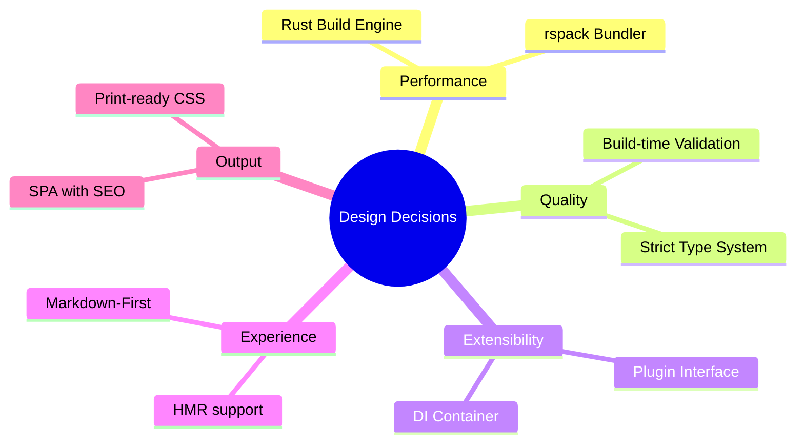

# Introduction

The **SSG Documentation Site Generator** is a high-performance, developer-focused tool for creating beautiful documentation sites from Markdown. It is built on modern technologies like **React 19**, **rspack**, **Bun**, and **Rust**, providing a lightning-fast experience for both authors and readers.

## Project Overview

This tool was designed to solve the limitations of traditional documentation generators:

- **Performance**: Uses **rspack** for near-instant bundling and **Rust** for heavy lifting in the build pipeline.
- **Rich Content**: Built-in support for **Mermaid.js** diagrams, **MathJax** equations, and Docusaurus-style **admonitions**[^1].
- **Developer Experience**: Hot Module Replacement (HMR) for both code and markdown content.
- **Quality Ensured**: A strict **validation system** checks for broken links, missing code block descriptions, and malformed diagrams at build time.

[^1]: Admonition syntax (:::tip) is compatible with Docusaurus and MkDocs.

## Core Concepts

The system operates on three primary abstractions:

### 1. The Compiler Engine (v2)
The engine treats your documentation as a collection of **Compilation Units**. It uses a stateful pipeline that handles parsing, syntax highlighting[^2], and HTML generation with guaranteed isolation between files.

[^2]: Pre-rendered using Shiki for zero-runtime overhead.

### 2. Middleware Architecture
Unlike traditional generators, every feature (from Mermaid diagrams to link checking) is a decoupled **Middleware**. This makes the system extremely extensible and allows for deep structural validation during the build.

### 3. Dependency Injection (DI)
The frontend uses a DI container to manage services like SEO, navigation, and theme state. This makes the components highly testable and allows for easy swapping of service implementations.

## Design Decisions

## Next Steps

- **[Installation](./02-installation)**: Get up and running in minutes.
- **[Build Pipeline](../architecture/01-build-pipeline)**: Understand the transformation process.
- **[CLI Reference](../guides/01-cli-reference)**: Learn about the `docts` command.
