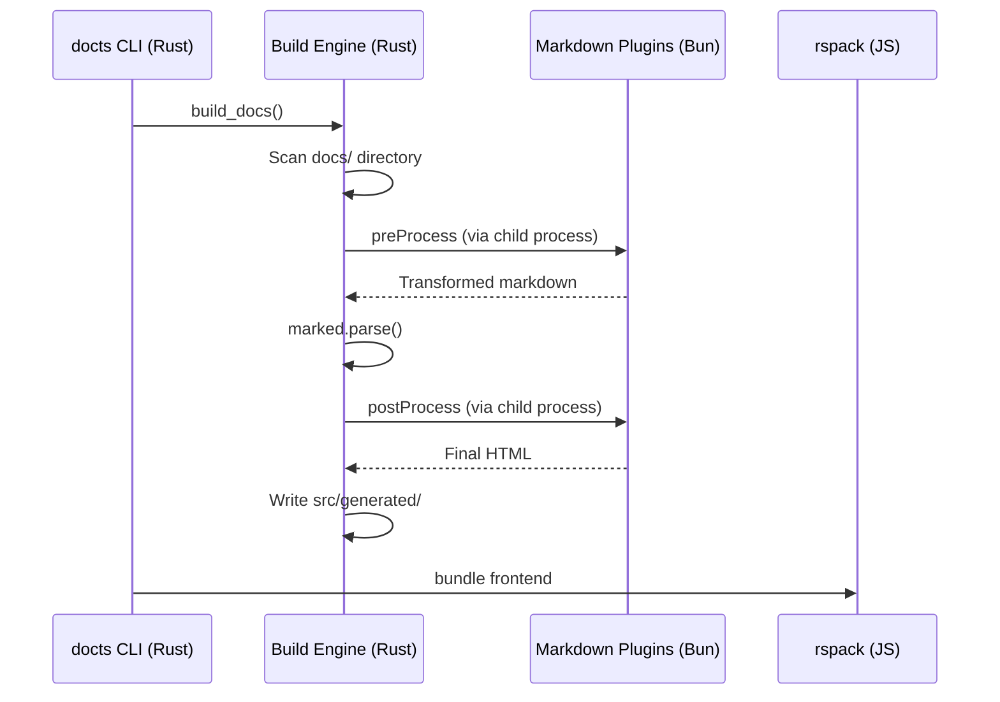

# Hybrid Toolchain

The project employs a **Hybrid Toolchain** approach, leveraging both **Bun** and **Rust** to optimize for different development needs.

## The Best of Both Worlds

We chose not to stick to a single language for tooling because each ecosystem has unique strengths that benefit our documentation SSG.

### Why Bun?
**Bun** is our primary runtime for scripts and development tasks. It provides:
- **Fast TypeScript execution**: No separate compilation step needed for scripts.
- **Built-in Test Runner**: Extremely fast unit and integration tests.
- **Node.js Compatibility**: Access to the vast NPM ecosystem (marked, shiki, mermaid).
- **HMR Support**: Essential for the live-preview development server.

### Why Rust?
**Rust** handles the performance-critical parts of the system. It provides:
- **Compiled Performance**: The build engine in `scripts-rs` is significantly faster at scanning large directory trees and processing strings.
- **Memory Safety**: Ensures the build tool is robust and doesn't crash during long-running processes.
- **Single Binary**: Can be compiled to a standalone `docts` CLI tool.

## Implementation Details

The system is split into two main parts:

1. **`scripts/` (Bun/TS)**:
   - High-level orchestrators (`cli.mts`).
   - Markdown plugins (`mermaid.ts`, `math.ts`) that rely on complex JS libraries.
   - Validation logic that uses heavy regex or AST analysis.

2. **`scripts-rs/` (Rust)**:
   - The core `build_docs` engine that handles file I/O and state management.
   - A unified CLI wrapper that calls into both Rust and Bun sub-commands.

## Execution Flow

When you run a command like `bun run build`, the following happens:

*Note: Currently, some parts of the pipeline are still being migrated from Bun to Rust. During this transition, both implementations exist and are kept in sync.*
