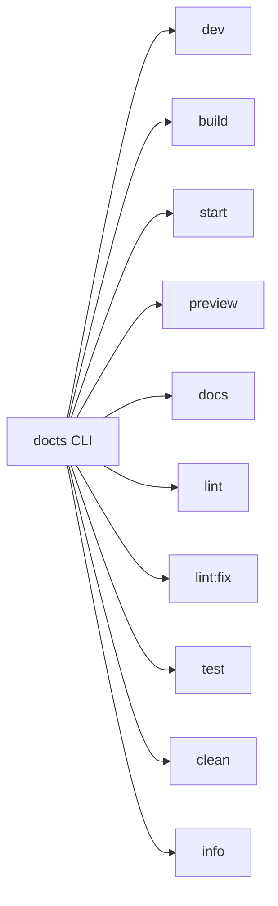
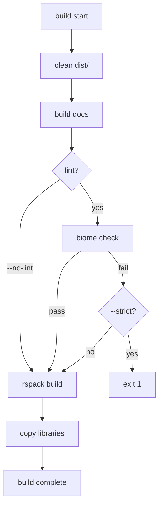
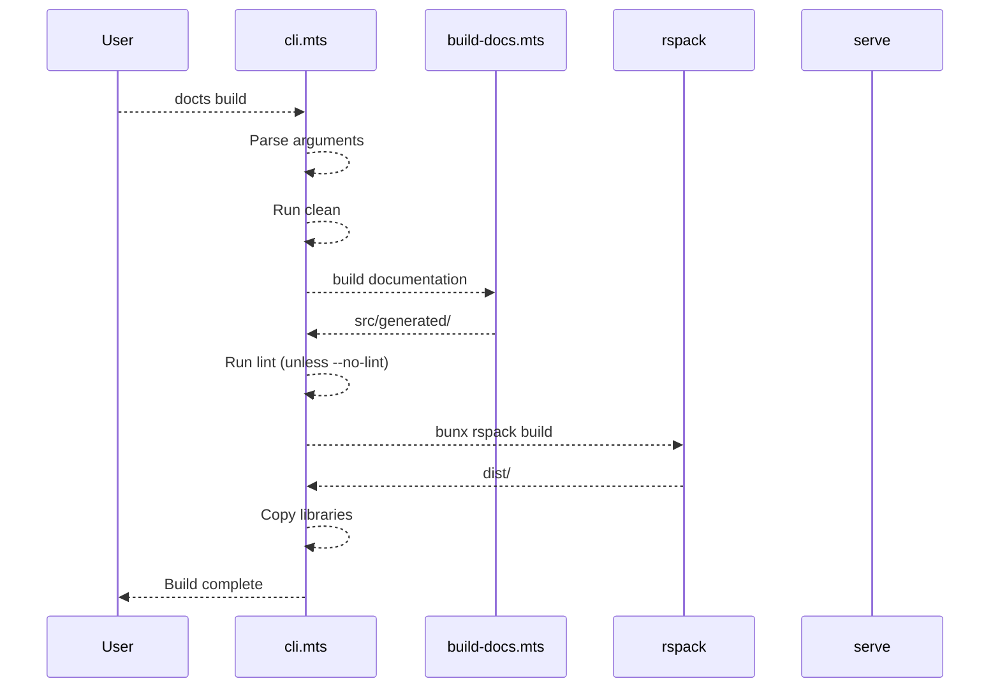

# CLI Reference

The `docts` CLI is the unified command-line interface for the SSG Documentation Site Generator. It handles everything from development to production deployment through a single entry point.

```:desc=CLI usage syntax
docts <command> [options]
```

The CLI is defined in [scripts/cli.mts](./scripts/cli.mts) and is registered as the package binary in `package.json`.

## Command Overview



## Commands

### `dev` (aliases: `serve`)

Starts the development server with Hot Module Replacement (HMR). Builds documentation from markdown sources and starts the rspack dev server.

```bash:desc=Dev command examples
docts dev              # Start on default port 3000
docts dev -p 8080      # Start on port 8080
docts serve            # Alias for dev
```

**What it does:**

1. Builds documentation via `scripts/build-docs.mts`
2. Starts rspack serve with HMR on the specified port
3. Auto-detects available ports if the requested port is in use

**Note:** Dev mode skips content validation to allow rapid iteration. Validation is enforced in CI/production builds.

### `build` (aliases: `bundle`)

Builds the project for production. Runs a multi-step pipeline including cleaning, documentation generation, linting, rspack bundling, and asset copying.

```bash:desc=Build command examples
docts build                    # Full production build
docts build --no-lint          # Skip lint checks
docts build --strict           # Fail on lint errors
docts build --skip-validation  # Skip content validation
docts build --no-clean         # Skip dist/ cleanup
docts bundle                   # Alias for build
```

**Build pipeline:**



**Steps:**

| Step | Action | Skip Flag |
|------|--------|-----------|
| 1 | Clean `dist/` directory | `--no-clean` |
| 2 | Build documentation (`scripts/build-docs.mts`) | None |
| 3 | Run Biome lint checks | `--no-lint` |
| 4 | rspack production build (`NODE_ENV=production`) | None |
| 5 | Copy third-party libraries (`scripts/copy-libs.mts`) | None |

### `start`

Serves the production build from `dist/` as a static file server with SPA fallback. Requires a prior `build`.

```bash:desc=Start command examples
docts start              # Serve on port 3000
docts start -p 4000      # Serve on port 4000
```

Uses the `serve` package under the hood: `npx serve dist -p <port> -s`.

### `preview`

Combines `build` + `start` in a single command. Builds the project and immediately serves it locally.

```bash:desc=Preview command examples
docts preview            # Build + serve on port 3000
docts preview -p 9000    # Build + serve on port 9000
```

All build options (`--no-lint`, `--strict`, `--no-clean`) apply to the build phase.

### `docs` (aliases: `docs:build`)

Regenerates documentation only -- scans markdown files and writes generated TypeScript to `src/generated/`. Does not trigger a rspack bundle build.

```bash:desc=Docs command examples
docts docs                      # Regenerate docs
docts docs --skip-validation    # Skip content validation
```

**What it does:**

1. Optionally validates content via `validate:strict`
2. Runs `scripts/build-docs.mts` to scan `docs/` and `blog/`
3. Generates `src/generated/` with sidebar data and doc entries
4. Reports file counts and statistics

### `lint` (aliases: `check`)

Runs Biome code quality checks across the project.

```bash:desc=Lint command examples
docts lint              # Check code quality
docts check             # Alias for lint
```

### `lint:fix`

Runs Biome with `--write` to auto-fix lint issues.

```bash:desc=Lint fix command
docts lint:fix          # Auto-fix lint issues
```

### `test` (aliases: `tests`)

Runs the test suite using Bun's built-in test runner.

```bash:desc=Test command examples
docts test              # Run tests once
docts test --watch      # Watch mode
docts test --coverage   # With coverage report
docts tests             # Alias for test
```

### `clean`

Removes build artifacts (`dist/` and `coverage/`).

```bash:desc=Clean command
docts clean             # Clean dist/ and coverage/
```

### `info` (aliases: `status`, `version`)

Displays project information including package details, file counts, build status, dependency versions, and available commands.

```bash:desc=Info command examples
docts info              # Show project information
docts status            # Alias for info
```

## Options

| Option | Alias | Applies To | Description |
|--------|-------|------------|-------------|
| `--port <port>` | `-p` | dev, start, preview | Specify port number (default: 3000) |
| `--no-lint` | | build, preview | Skip lint checks during build |
| `--skip-validation` | | docs | Skip codeblock description validation |
| `--strict` | | build | Fail build on lint errors |
| `--no-clean` | | build | Skip dist/ cleanup |
| `--watch` | | test | Watch mode for tests |
| `--coverage` | | test | Generate coverage report |
| `--help` | `-h` | all | Show help message |
| `--version` | `-v` | all | Show version |

## Command Aliases

The CLI maps several alternative command names to the same handler:

| Primary | Aliases |
|---------|---------|
| `dev` | `serve` |
| `build` | `bundle` |
| `docs` | `docs:build` |
| `lint` | `check` |
| `lint:fix` | `lint --fix` |
| `test` | `tests` |
| `info` | `status` |

## NPM Script Wrappers

The project's `package.json` provides convenience scripts:

```json:desc=NPM scripts in package.json
{
  "dev": "bun run scripts/cli.mts dev",
  "build": "bun run scripts/cli.mts build",
  "start": "bun run scripts/cli.mts start",
  "preview": "bun run scripts/cli.mts preview",
  "build:docs": "bun run scripts/cli.mts docs",
  "test": "bun run scripts/cli.mts test",
  "test:watch": "bun run scripts/cli.mts test --watch",
  "test:coverage": "bun run scripts/cli.mts test --coverage",
  "lint": "bun run scripts/cli.mts lint",
  "lint:fix": "bun run scripts/cli.mts lint:fix",
  "clean": "bun run scripts/cli.mts clean",
  "info": "bun run scripts/cli.mts info"
}
```

Usage:

```bash:desc=Bun run examples
bun run dev                    # Equivalent to docts dev
bun run build                  # Equivalent to docts build
bun run test:coverage          # Equivalent to docts test --coverage
```

## Examples

```bash:desc=CLI command examples
# Development workflow
docts dev                      # Start dev server on port 3000
docts dev -p 8080              # Start dev server on port 8080

# Production build
docts build                    # Full production build
docts build --no-lint          # Build without lint
docts build --strict           # Strict mode -- fail on lint errors

# Local preview
docts preview                  # Build + preview locally
docts preview -p 9000          # Build + preview on port 9000

# Testing
docts test                     # Run test suite
docts test --watch             # Watch mode
docts test --coverage          # Run with coverage report

# Validation
docts docs                     # Regenerate documentation
docts docs --skip-validation   # Skip validation
```

## CLI Architecture



## Related

- [Validation System](/docs/03-guides/05-validation-system) -- the `--strict` and `--skip-validation` flags control content validation
- [Writing Plugins](/docs/03-guides/06-writing-plugins) -- the build pipeline applies markdown plugins
- [Testing Strategy](/docs/03-guides/08-testing-strategy) -- the `test` command runs the test suite
