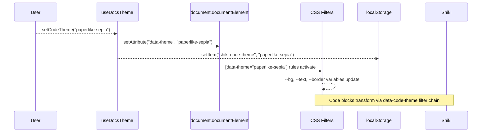

# CSS & Theme Architecture

The rspack-react-docs project uses a dual-theme system: **UI themes** for the application shell and **code themes** for syntax-highlighted code blocks. Both systems work together through CSS custom properties and filter-based transforms.

## Theme Overview

The project ships with **7 visual themes**, each configured through the `data-theme` attribute on the `<html>` element:

| Theme | Background | Style | Best For |
|-------|-----------|-------|----------|
| `paperlike-white` | `#ffffff` | Clean white paper | Bright environments |
| `paperlike-gray` | `#e8e8e8` | Soft gray | Reduced eye strain |
| `paperlike-sepia` | `#f4ecd8` | Warm parchment | Reading comfort |
| `paperlike-dark-gray` | `#2a2a2a` | Dark neutral | Low-light coding |
| `paperlike-dark-sepia` | `#2c241b` | Dark warm | Evening reading |
| `navy` | `#f0f4f8` | Light blue | Fresh, modern |
| `dark-navy` | `#0f172a` | Deep blue dark | Night coding |

Each theme defines a complete set of CSS custom properties:

```css:desc=Paper-like dark gray theme CSS custom properties
[data-theme="paperlike-dark-gray"] {
  --ifm-color-primary: #7ba3cc;
  --ifm-color-primary-dark: #5b8db8;
  --ifm-color-primary-light: #9bb5d8;
  --bg: #2a2a2a;
  --bg-surface: #333333;
  --bg-code: #383838;
  --border: #444444;
  --text: #d0d0d0;
  --text-secondary: #999999;
}
```

## CSS File Structure

The styles are organized into **22 CSS files** in `src/styles/`:

```mermaid:desc=CSS file organization diagram
flowchart TD
    Root["index.css"] --> Vars["variables.css"]
    Root --> Layout["layout.css"]
    Root --> States["states.css"]
    Root --> Panels["panels.css"]
    Root --> Responsive["responsive.css"]
    Root --> Code["code-blocks.css"]
    Root --> Shiki["shiki-themes.css"]
    Root --> Adm["admonitions.css"]
    Root --> Breadcrumbs["breadcrumbs.css"]
    Root --> Meta["metadata.css"]
    Root --> TOC["toc.css"]
    Root --> Article["article-links-panel.css"]
    Root --> DocContent["doc-content.css"]
    Root --> Footer["doc-footer.css"]
    Root --> StatsFooter["doc-stats-footer.css"]
    Root --> Error["error-boundary.css"]
    Root --> Math["math.css"]
    Root --> Mermaid["mermaid.css"]
    Root --> Blog["blog.css"]
    Root --> PrintMedia["print-media.css"]
    Root --> PrintView["print-view.css"]
```



| File | Purpose |
|------|---------|
| `index.css` | Entry point -- imports all other stylesheets |
| `variables.css` | Root CSS custom properties and theme definitions |
| `layout.css` | Site wrapper, main content grid, page layout |
| `states.css` | Interactive states (hover, focus, active) |
| `panels.css` | Sidebar and TOC panel layouts |
| `responsive.css` | Mobile breakpoints and responsive behavior |
| `code-blocks.css` | Code block containers, headers, copy buttons |
| `shiki-themes.css` | CSS filter chains for code theme switching |
| `admonitions.css` | Admonition callout styling (note, tip, warning, etc.) |
| `breadcrumbs.css` | Breadcrumb navigation styling |
| `metadata.css` | Document metadata display (author, date, tags) |
| `toc.css` | Table of contents sidebar styling |
| `article-links-panel.css` | Article link panel styling |
| `doc-content.css` | Main document content typography and spacing |
| `doc-footer.css` | Document footer with prev/next navigation |
| `doc-stats-footer.css` | Reading time and word count display |
| `error-boundary.css` | Error boundary fallback styling |
| `math.css` | MathJax inline and display math styling |
| `mermaid.css` | Mermaid diagram containers and zoom UI |
| `blog.css` | Blog-specific styling |
| `print-media.css` | `@media print` rules for browser print |
| `print-view.css` | Dedicated print preview UI |

## Theme Switching Architecture



### UI Theme vs Code Theme

The system separates UI theme from code theme, but unifies them through the `useDocsTheme` hook:

1. **`data-theme` attribute** -- Controls UI colors via CSS custom properties in `variables.css`
2. **`data-code-theme` attribute** -- Controls code block appearance via CSS filter chains in `shiki-themes.css`

When you call `setCodeTheme(theme)`, it sets **both** attributes so the UI and code blocks stay synchronized.

## CSS Filter-Based Code Theme Switching

Shiki renders syntax highlighting at **build time** with inline styles using the `github-dark` theme. At runtime, we transform the appearance using CSS filter chains -- no re-build needed.

```css:desc=CSS filter chains for Shiki theme switching
/* shiki-themes.css */

/* paperlike-white: light theme, slight warm tint */
[data-code-theme="paperlike-white"] .code-block {
  filter: invert(1) hue-rotate(180deg) brightness(1.02);
}

/* paperlike-gray: neutral gray, readable */
[data-code-theme="paperlike-gray"] .code-block {
  filter: invert(1) hue-rotate(180deg) saturate(0.8) brightness(1.05);
}

/* paperlike-sepia: warm sepia tones */
[data-code-theme="paperlike-sepia"] .code-block {
  filter: sepia(0.3) saturate(1.2) brightness(1.05) hue-rotate(10deg);
}

/* paperlike-dark-gray: dark gray, high contrast */
[data-code-theme="paperlike-dark-gray"] .code-block {
  filter: saturate(0.9) brightness(0.95) contrast(1.1);
}

/* paperlike-dark-sepia: dark warm tones */
[data-code-theme="paperlike-dark-sepia"] .code-block {
  filter: sepia(0.2) saturate(1.1) brightness(0.95) hue-rotate(15deg) contrast(1.05);
}

/* navy: light blue-tinted */
[data-code-theme="navy"] .code-block {
  filter: invert(1) hue-rotate(200deg) saturate(1.1) brightness(1.03);
}

/* dark-navy: deep blue tones */
[data-code-theme="dark-navy"] .code-block {
  filter: saturate(1.2) hue-rotate(210deg) brightness(0.9) contrast(1.1);
}
```

This approach means Shiki only needs to render once (as `github-dark`), and all 7 themes are achieved through CSS filter transformations at runtime.

## Goober Setup

The project uses [goober](https://github.com/cristianbote/goober) for CSS-in-JS in specific components. It is configured with a custom `createElement` pragma:

```typescript:desc=Goober setup with createElement pragma
import { setup } from "goober";
import { createElement } from "react";

setup(createElement);
```

This allows components to use the `css` tagged template literal for scoped styles:

```typescript:desc=Goober css tagged template literal example
const buttonStyle = css`
  background: var(--ifm-color-primary);
  color: white;
  border: none;
  border-radius: 0.5rem;
  padding: 0.75rem 2rem;
  cursor: pointer;
`;
```

## Theme Persistence

Themes are persisted to `localStorage` under the following keys:

| Key | Stores |
|-----|--------|
| `shiki-code-theme` | Active code theme (e.g., `"paperlike-dark-gray"`) |
| `docs-font-size` | Font size in pixels (12-20, default: 15) |
| `docs-line-height` | Line height (1.2-2.2, default: 1.6) |
| `docs-font` | Font family preference (default: `"system"`) |

These are read on initialization by `useDocsTheme` and `useShikiTheme`, and written whenever preferences change.

## Custom CSS Properties

The theme system exposes user-adjustable CSS custom properties on `document.documentElement`:

```css:desc=Custom CSS properties for reading preferences
--docs-font-size: 15px;    /* Font size (12-20px) */
--docs-line-height: 1.6;   /* Line height (1.2-2.2) */
```

Applied via:

```typescript:desc=Setting custom CSS properties in JavaScript
document.documentElement.style.setProperty("--docs-font-size", `${fontSize}px`);
document.documentElement.style.setProperty("--docs-line-height", String(lineHeight));
```

The base `html` rule in `variables.css` uses these as fallback-aware values:

```css:desc=HTML and body CSS with fallback values
html {
  font-size: var(--docs-font-size, 15px);
  scroll-behavior: smooth;
}

body {
  line-height: var(--docs-line-height, 1.6);
}
```

## Related

- [React Hooks](/docs/guides/react-hooks) -- `useDocsTheme`, `useShikiTheme`, and `useTheme` hooks
- [Print Export](/docs/guides/print-export) -- Print-friendly theme overrides
- [CLI Reference](/docs/guides/cli-reference) -- `docts build` generates the static assets

## References

- [goober](https://github.com/cristianbote/goober) -- CSS-in-JS library
