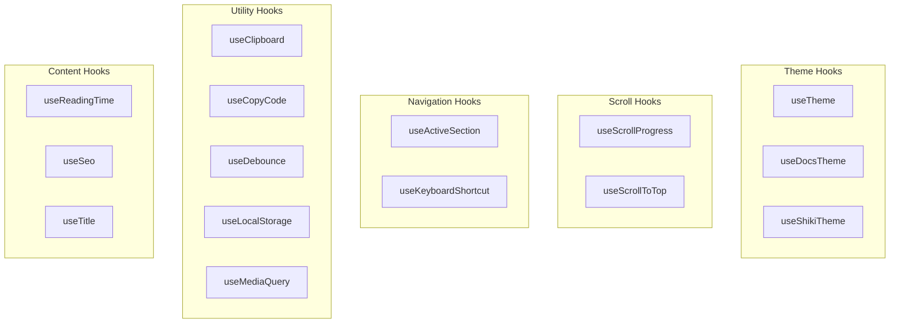

# React Hooks

The project includes **16 custom React hooks** in `src/hooks/`. Each hook solves a specific problem in the documentation site -- from theme management to SEO to keyboard shortcuts.



All hooks are barrel-exported from `src/hooks/index.ts`:

```typescript:desc=Hooks barrel export showing all 16 exported hooks
export { useActiveSection } from "./useActiveSection";
export { useClipboard } from "./useClipboard";
export { useCopyCode } from "./useCopyCode";
export { useDebounce } from "./useDebounce";
export { useDocsTheme } from "./useDocsTheme";
export { useKeyboardShortcut } from "./useKeyboardShortcut";
export { useLocalStorage } from "./useLocalStorage";
export { useMediaQuery } from "./useMediaQuery";
export { useReadingTime } from "./useReadingTime";
export { useScrollProgress } from "./useScrollProgress";
export { useScrollToTop } from "./useScrollToTop";
export { useSeo } from "./useSeo";
export { useShikiTheme } from "./useShikiTheme";
export { useTheme } from "./useTheme";
export { useTitle } from "./useTitle";
```

---

## useActiveSection

**File:** `src/hooks/useActiveSection.ts`

Tracks which heading section is currently visible in the viewport using `IntersectionObserver`. Returns the active heading ID string.

**Signature:**

```typescript:desc=useActiveSection function signature with selector parameter
function useActiveSection(
  selector?: string  // default: ".doc-content h2, .doc-content h3"
): string
```

**Usage:**

```typescript:desc=useActiveSection usage example
const activeId = useActiveSection();
// Returns: "getting-started", "installation", etc.

// Use to highlight current TOC item
<li className={activeId === "installation" ? "active" : ""}>
  <a href="#installation">Installation</a>
</li>
```

**Implementation Notes:**

- Creates a new `IntersectionObserver` whenever the observed headings change
- Uses `rootMargin: "0px 0px -80% 0px"` to only consider headings in the top 20% of the viewport as "active"
- Disconnects and recreates the observer when the selector changes or component unmounts

---

## useClipboard

**File:** `src/hooks/useClipboard.ts`

Generic copy-to-clipboard utility with "copied!" feedback state.

**Signature:**

```typescript:desc=useClipboard hook interface and function signature
interface UseClipboardOptions {
  duration?: number;  // default: 2000ms
}

function useClipboard(options?: UseClipboardOptions): [copied: boolean, copy: (text: string) => Promise<boolean>]
```

**Usage:**

```typescript:desc=useClipboard hook usage example
const [copied, copy] = useClipboard({ duration: 1500 });

<button onClick={() => copy("some text")}>
  {copied ? "Copied!" : "Copy"}
</button>
```

**Implementation Notes:**

- Uses `navigator.clipboard.writeText()` as primary method
- Falls back to `document.execCommand("copy")` with a hidden textarea for older browsers / non-HTTPS contexts
- Returns `true` on success, manages its own timeout for the feedback state

---

## useCopyCode

**File:** `src/hooks/useCopyCode.ts`

Hook for the "Copy" button on code blocks. Extracts `textContent` from a code block element and copies it.

**Signature:**

```typescript:desc=UseCopyCode hook interface definition
interface UseCopyCodeOptions {
  duration?: number;  // default: 2000ms
}

function useCopyCode(options?: UseCopyCodeOptions): { copied: boolean; copyCode: (codeBlock: HTMLElement | null) => Promise<boolean> }
```

**Usage:**

```typescript:desc=useCopyCode hook usage example
const { copied, copyCode } = useCopyCode();

<button onClick={() => copyCode(preElement)}>
  {copied ? "Copied!" : "Copy"}
</button>
```

**Implementation Notes:**

- Similar to `useClipboard` but operates on DOM elements directly (extracts `textContent`)
- Returns an object instead of a tuple for clearer API
- Used by code block copy buttons rendered by the build pipeline

---

## useDebounce

**File:** `src/hooks/useDebounce.ts`

Debounces a value -- returns a stable version that only updates after the specified delay.

**Signature:**

```typescript:desc=useDebounce hook signature
function useDebounce<T>(value: T, delayMs?: number): T  // default delay: 300ms
```

**Usage:**

```typescript:desc=useDebounce usage example
const [search, setSearch] = useState("");
const debouncedSearch = useDebounce(search, 300);

// debouncedSearch only updates 300ms after the user stops typing
useEffect(() => {
  filterDocs(debouncedSearch);
}, [debouncedSearch]);
```

**Implementation Notes:**

- Simple `setTimeout`/`clearTimeout` pattern
- Cleans up timer on unmount or when value/delay changes

---

## useDocsTheme

**File:** `src/hooks/useDocsTheme.ts`

Unified theme hook that manages **both UI theme and code block (Shiki) theme**, plus reading preferences (font size, line height, font family).

**Signature:**

```typescript:desc=useDocsTheme hook interface and function signature
interface DocsTheme {
  isDark: boolean;
  toggleTheme: () => void;
  codeTheme: ShikiCodeTheme;
  setCodeTheme: (theme: ShikiCodeTheme) => void;
  font: string;
  setFont: (font: string) => void;
  fontSize: number;
  setFontSize: (size: number) => void;
  lineHeight: number;
  setLineHeight: (height: number) => void;
  resetReadingPrefs: () => void;
}

function useDocsTheme(): DocsTheme
```

**Usage:**

```typescript:desc=useDocsTheme hook usage example
const { isDark, toggleTheme, codeTheme, setCodeTheme, fontSize, setFontSize } = useDocsTheme();

// Toggle dark/light
<button onClick={toggleTheme}>{isDark ? "Light" : "Dark"}</button>

// Switch code theme
<select value={codeTheme} onChange={e => setCodeTheme(e.target.value as ShikiCodeTheme)}>
  <option value="paperlike-dark-gray">Dark Gray</option>
  <option value="paperlike-white">White</option>
  <option value="paperlike-sepia">Sepia</option>
</select>

// Adjust font size
<input type="range" min={12} max={20} value={fontSize} onChange={e => setFontSize(+e.target.value)} />
```

**Implementation Notes:**

- Integrates with the DI container's theme service (`useServices()`)
- Persists preferences to `localStorage`: `shiki-code-theme`, `docs-font-size`, `docs-line-height`, `docs-font`
- Font size clamped to 12-20px, line height to 1.2-2.2
- Applies reading preferences via CSS custom properties on `document.documentElement`
- Default code theme: `paperlike-dark-gray`
- Validates theme values through `isValidTheme()` type guard

---

## useKeyboardShortcut

**File:** `src/hooks/useKeyboardShortcut.ts`

Registers global keyboard shortcuts with modifier key support.

**Signature:**

```typescript:desc=useKeyboardShortcut hook interface and function signature
interface ShortcutOptions {
  key: string;          // e.g., "k", "Escape", "/"
  meta?: boolean;       // Requires Cmd/Ctrl
  alt?: boolean;        // Requires Alt
  shift?: boolean;      // Requires Shift
  preventDefault?: boolean;  // Prevent default (default: true)
}

function useKeyboardShortcut(
  handler: () => void,
  options: ShortcutOptions
): void
```

**Usage:**

```typescript:desc=useKeyboardShortcut usage examples
// Cmd+B to toggle sidebar
useKeyboardShortcut(() => toggleSidebar(), { key: "b", meta: true });

// Escape to close modal
useKeyboardShortcut(() => closeModal(), { key: "Escape" });

// Cmd+T to toggle TOC
useKeyboardShortcut(() => toggleToc(), { key: "t", meta: true });
```

**Implementation Notes:**

- Uses `useRef` to always call the latest handler without re-registering the event listener
- Treats `meta` and `ctrl` as equivalent (works on both macOS and Windows/Linux)
- When `meta: false`, it explicitly rejects events where meta/ctrl IS pressed (prevents accidental matches)
- Supports `preventDefault` to block browser behavior

---

## useLocalStorage

**File:** `src/hooks/useLocalStorage.ts`

Syncs React state with `localStorage`. Auto-serializes/deserializes.

**Signature:**

```typescript:desc=useLocalStorage hook signature
function useLocalStorage<T>(
  key: string,
  initialValue: T
): [T, (value: T | ((prev: T) => T)) => void]
```

**Usage:**

```typescript:desc=useLocalStorage usage example
const [collapsed, setCollapsed] = useLocalStorage("sidebar-collapsed", false);

// Supports updater function (like useState)
setCollapsed(prev => !prev);
setCollapsed(true);
```

**Implementation Notes:**

- JSON serialization via `JSON.stringify`/`JSON.parse`
- Supports updater function pattern: `set(value)` or `set(prev => newValue)`
- Silently fails on storage errors (private browsing, quota exceeded)
- Perses on every value change via `useEffect`

---

## useMediaQuery

**File:** `src/hooks/useMediaQuery.ts`

Reactively tracks a CSS media query's match state.

**Signature:**

```typescript:desc=useMediaQuery hook signature
function useMediaQuery(query: string): boolean
```

**Usage:**

```typescript:desc=useMediaQuery usage example
const isMobile = useMediaQuery("(max-width: 800px)");
const prefersDark = useMediaQuery("(prefers-color-scheme: dark)");

{isMobile && <MobileMenu />}
```

**Implementation Notes:**

- Uses `window.matchMedia()` with `addEventListener("change", ...)`
- SSR-safe: returns `false` when `window` is undefined
- Subscribes on mount, unsubscribes on unmount

---

## useReadingTime

**File:** `src/hooks/useReadingTime.ts`

Estimates reading time in minutes based on word count.

**Signature:**

```typescript:desc=useReadingTime hook signature
function useReadingTime(
  text: string | undefined | null,
  wordsPerMinute?: number  // default: 225
): { minutes: number; words: number; formatted: string }
```

**Usage:**

```typescript:desc=useReadingTime usage example
const { minutes, words, formatted } = useReadingTime(docContent);
// { minutes: 5, words: 1125, formatted: "5 min read" }

<span>{formatted}</span>  // "5 min read"
```

**Implementation Notes:**

- Strips HTML tags, code blocks, and markdown syntax to get plain text word count
- Default reading speed: 225 words per minute (average adult)
- Returns `"< 1 min read"` for content under 225 words
- This is a utility hook (no `useEffect` or state) -- it computes synchronously

---

## useScrollProgress

**File:** `src/hooks/useScrollProgress.ts`

Returns a value between 0 and 1 representing how far the user has scrolled through the main content area.

**Signature:**

```typescript:desc=useScrollProgress hook signature
function useScrollProgress(
  contentSelector?: string  // default: ".main-content"
): number
```

**Usage:**

```typescript:desc=useScrollProgress usage example
const progress = useScrollProgress();

<div className="progress-bar" style={{ width: `${progress * 100}%` }} />
```

**Implementation Notes:**

- Calculates `scrollTop / (scrollHeight - innerHeight)`
- Clamped to 0-1 range
- Listens to `scroll` (passive) and `resize` events
- Returns 0 when content doesn't overflow viewport

---

## useScrollToTop

**File:** `src/hooks/useScrollToTop.ts`

Returns a scroll-to-top function and a visibility flag.

**Signature:**

```typescript:desc=useScrollToTop hook interface and function signature
interface UseScrollToTopOptions {
  threshold?: number;       // Show after this many px (default: 300)
  behavior?: ScrollBehavior; // default: "smooth"
}

function useScrollToTop(options?: UseScrollToTopOptions): { visible: boolean; scrollToTop: () => void }
```

**Usage:**

```typescript:desc=useScrollToTop usage example
const { visible, scrollToTop } = useScrollToTop({ threshold: 400 });

{visible && (
  <button onClick={scrollToTop} className="scroll-to-top">
    ↑
  </button>
)}
```

**Implementation Notes:**

- Visibility toggles when `scrollY > threshold`
- Uses passive scroll listener for performance
- `window.scrollTo({ top: 0, behavior: "smooth" })` by default

---

## useSeo

**File:** `src/hooks/useSeo.ts`

Dynamically updates SEO meta tags, structured data, and social sharing tags based on the current document.

**Signature:**

```typescript:desc=useSeo hook interface and function signature
interface UseSeoOptions {
  title?: string;
  description?: string;
  slug?: string;           // e.g., "guides/build-system"
  siteUrl?: string;        // default: "https://your-docs-site.com"
  siteName?: string;       // default: "Documentation"
  author?: string;
  date?: string;
  tags?: string[];
  toc?: { value: string; id: string; level: number }[];
}

function useSeo(options?: UseSeoOptions): void
```

**Usage:**

```typescript:desc=useSeo hook usage example
useSeo({
  title: doc.title,
  description: doc.description,
  slug: doc.slug,
  author: doc.author,
  date: doc.date,
  tags: doc.tags,
  toc: doc.toc,
});
```

**Implementation Notes:**

- Updates `document.title` with format: `"{title} -- {siteName}"`
- Creates/updates meta tags: `description`, `og:title`, `og:description`, `og:url`, `og:site_name`, `og:type`
- Sets Twitter Card tags: `twitter:title`, `twitter:description`, `twitter:card`
- Generates JSON-LD `Article` schema with `hasPart` from TOC items
- Adds LLM-friendly `data-*` attributes on `#root` for machine parsing
- Updates canonical URL via `#canonical` link element

---

## useShikiTheme

**File:** `src/hooks/useShikiTheme.ts`

Manages code block syntax highlighting theme independently from UI theme.

**Signature:**

```typescript:desc=useShikiTheme hook type and function signature
type ShikiCodeTheme =
  | "paperlike-white"
  | "paperlike-gray"
  | "paperlike-sepia"
  | "paperlike-dark-gray"
  | "paperlike-dark-sepia"
  | "navy"
  | "dark-navy";

function useShikiTheme(): [ShikiCodeTheme, (theme: ShikiCodeTheme) => void]
```

**Usage:**

```typescript:desc=useShikiTheme usage example
const [codeTheme, setCodeTheme] = useShikiTheme();

<select value={codeTheme} onChange={e => setCodeTheme(e.target.value)}>
  {themes.map(t => <option key={t} value={t}>{t}</option>)}
</select>
```

**Implementation Notes:**

- Sets `data-code-theme` attribute on `<html>` to trigger CSS filter chains
- Persists to `localStorage` under `shiki-code-theme`
- Listens for `storage` events for cross-tab synchronization
- Default theme: `paperlike-dark-gray`
- See [CSS & Theme Architecture](/docs/guides/css-theme-architecture) for filter chain details

---

## useTheme

**File:** `src/hooks/useTheme.ts`

Basic dark/light theme toggle using the DI theme service.

**Signature:**

```typescript:desc=useTheme hook signature
function useTheme(): [isDark: boolean, toggleTheme: () => void]
```

**Usage:**

```typescript:desc=useTheme hook usage example
const [isDark, toggleTheme] = useTheme();

<button onClick={toggleTheme}>
  {isDark ? "Switch to Light" : "Switch to Dark"}
</button>
```

**Implementation Notes:**

- Uses DI container's theme service (`useServices().theme`)
- Reads initial theme from service (stored preference or OS preference)
- Persists to storage service on toggle
- Simpler alternative to `useDocsTheme` when you only need dark/light toggle

---

## useTitle

**File:** `src/hooks/useTitle.ts`

Updates the document title with cleanup on unmount.

**Signature:**

```typescript:desc=useTitle hook signature
function useTitle(docTitle: string, siteName?: string): void  // default siteName: "Docs"
```

**Usage:**

```typescript:desc=useTitle hook usage example
useTitle("Getting Started", "My Docs");
// Sets document.title to "Getting Started – My Docs"
```

**Implementation Notes:**

- Format: `"{docTitle} – {siteName}"`
- Restores previous title on unmount (useful when navigating between docs)
- Simple wrapper around `document.title` with proper cleanup

---

## Related

- [CSS & Theme Architecture](/docs/guides/css-theme-architecture) -- how themes are styled via CSS
- [SEO Optimization](/docs/guides/seo-optimization) -- deep dive into `useSeo`
- [Dependency Injection](/docs/architecture/dependency-injection) -- how hooks use services
