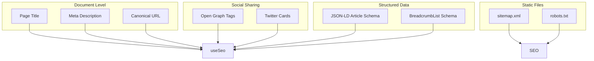
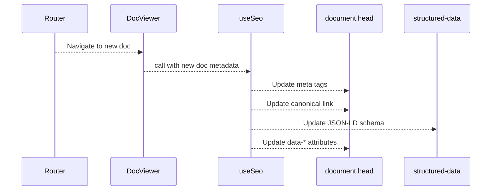

# SEO Optimization

The documentation site includes a comprehensive SEO system that dynamically updates meta tags, structured data, and social sharing tags for every page.

## Overview



## useSeo Hook

The `useSeo` hook (`src/hooks/useSeo.ts`) is the central engine for dynamic SEO. It runs on every navigation to update the document's meta information.

```typescript:desc=useSeo hook usage example
useSeo({
  title: "CLI Reference",
  description: "Complete reference for the docts CLI commands",
  slug: "guides/cli-reference",
  siteUrl: "https://your-docs-site.com",
  siteName: "Documentation",
  author: "Jane Doe",
  date: "2026-04-15",
  tags: ["cli", "reference", "commands"],
  toc: [
    { value: "Command Overview", id: "command-overview", level: 2 },
    { value: "Commands", id: "commands", level: 2 },
  ],
});
```

### What It Updates

| Target | Meta Tag / Element | Value |
|--------|-------------------|-------|
| Page title | `document.title` | `"{title} -- {siteName}"` |
| Description | `<meta name="description">` | Page description |
| Canonical | `<link id="canonical">` | `{siteUrl}/docs/{slug}` |
| Open Graph title | `<meta property="og:title">` | Full title |
| Open Graph desc | `<meta property="og:description">` | Description |
| Open Graph URL | `<meta property="og:url">` | Canonical URL |
| Open Graph site | `<meta property="og:site_name">` | Site name |
| Open Graph type | `<meta property="og:type">` | `"article"` |
| Twitter title | `<meta name="twitter:title">` | Full title |
| Twitter desc | `<meta name="twitter:description">` | Description |
| Twitter card | `<meta name="twitter:card">` | `"summary"` |
| JSON-LD | `<script id="structured-data">` | Article schema |

## JSON-LD Structured Data

The hook generates an `Article` schema using Schema.org vocabulary:

```json:desc=JSON-LD Article schema example
{
  "@context": "https://schema.org",
  "@type": "Article",
  "headline": "CLI Reference",
  "description": "Complete reference for the docts CLI commands",
  "url": "https://your-docs-site.com/docs/guides/cli-reference",
  "mainEntityOfPage": {
    "@type": "WebPage",
    "@id": "https://your-docs-site.com/docs/guides/cli-reference"
  },
  "publisher": {
    "@type": "Organization",
    "name": "Documentation"
  },
  "author": {
    "@type": "Person",
    "name": "Jane Doe"
  },
  "datePublished": "2026-04-15",
  "dateModified": "2026-04-15",
  "keywords": "cli, reference, commands",
  "hasPart": [
    {
      "@type": "ArticleSection",
      "name": "Command Overview",
      "url": "https://your-docs-site.com/docs/guides/cli-reference#command-overview"
    },
    {
      "@type": "ArticleSection",
      "name": "Commands",
      "url": "https://your-docs-site.com/docs/guides/cli-reference#commands"
    }
  ]
}
```

### Schema Fields

| Field | Source | Condition |
|-------|--------|-----------|
| `headline` | `title` | Always |
| `description` | `description` | Always |
| `url` | Computed from `siteUrl` + `slug` | Always |
| `mainEntityOfPage` | Same URL | Always |
| `publisher` | `siteName` | Always |
| `author` | `author` | If provided |
| `datePublished` / `dateModified` | `date` | If provided |
| `keywords` | `tags` (joined) | If provided |
| `hasPart` | `toc` (mapped to ArticleSection) | If provided |

The `hasPart` sections include anchor links to each TOC item, enabling search engines to deep-link into specific sections of the document.

## Open Graph Tags

Open Graph tags enable rich previews when the page is shared on social platforms:

```html:desc=Open Graph meta tags example
<meta property="og:title" content="CLI Reference -- Documentation">
<meta property="og:description" content="Complete reference for the docts CLI commands">
<meta property="og:url" content="https://your-docs-site.com/docs/guides/cli-reference">
<meta property="og:site_name" content="Documentation">
<meta property="og:type" content="article">
```

## Twitter Cards

Twitter Card tags control how the page appears when shared on X/Twitter:

```html:desc=Twitter Card meta tags example
<meta name="twitter:card" content="summary">
<meta name="twitter:title" content="CLI Reference -- Documentation">
<meta name="twitter:description" content="Complete reference for the docts CLI commands">
```

The `summary` card type creates a compact preview with title, description, and thumbnail.

## Canonical URLs

The canonical URL link element prevents duplicate content issues:

```html:desc=Canonical URL link element
<link rel="canonical" id="canonical" href="https://your-docs-site.com/docs/guides/cli-reference">
```

The `#canonical` element must exist in the HTML template. The hook finds it by ID and updates its `href` attribute.

## Static SEO Files

### sitemap.xml

Located at the project root, `sitemap.xml` lists all available pages for search engine crawlers:

```xml:desc=sitemap.xml example
<?xml version="1.0" encoding="UTF-8"?>
<urlset xmlns="http://www.sitemaps.org/schemas/sitemap/0.9">
  <url>
    <loc>https://your-docs-site.com/docs/abstract</loc>
    <priority>1.0</priority>
  </url>
  <!-- ... more URLs -->
</urlset>
```

### robots.txt

The `robots.txt` file at the project root controls crawler behavior:

```:desc=robots.txt example
User-agent: *
Allow: /

Sitemap: https://your-docs-site.com/sitemap.xml
```

## LLM-Friendly Content Hints

The `useSeo` hook also adds `data-*` attributes to the `#root` element for machine-readable content hints:

```html:desc=LLM-friendly data attributes example
<div id="root"
  data-page-slug="guides/cli-reference"
  data-page-title="CLI Reference"
  data-page-description="Complete reference for the docts CLI commands">
```

These attributes enable external tools (LLMs, scrapers, indexers) to quickly extract page metadata without parsing the full DOM.

## Semantic HTML Structure

The build pipeline generates semantic HTML that reinforces SEO:

- **Headings**: Proper hierarchy (`h1` > `h2` > `h3`) with unique `id` attributes
- **Articles**: Content wrapped in semantic `<article>` elements
- **Navigation**: Sidebar and TOC use `<nav>` elements
- **Code blocks**: Language metadata in `data-lang` attributes
- **Links**: Internal links use absolute `/docs/` paths for crawlability

## Dynamic Meta Updates on Navigation

Because this is a SPA, `useSeo` runs as a side effect whenever the user navigates between documents:



All updates happen via `useEffect`, which runs synchronously after render. Existing meta elements are updated in-place rather than recreated.

## SEO Checklist

When deploying a documentation site, verify:

- [ ] `sitemap.xml` is present and lists all pages
- [ ] `robots.txt` allows crawling and references the sitemap
- [ ] Each doc has a unique `title` and `description` in frontmatter
- [ ] `siteUrl` in `useSeo` is set to the production domain
- [ ] JSON-LD schema includes `author` and `date` for blog posts
- [ ] Canonical URLs resolve correctly
- [ ] Open Graph preview image is set (add `og:image` meta tag in `index.html`)

## Related

- [React Hooks](/docs/guides/react-hooks) -- `useSeo` hook reference
- [Validation System](/docs/guides/validation-system) -- validates frontmatter fields
- [Writing Plugins](/docs/guides/writing-plugins) -- extend the build pipeline for SEO metadata
