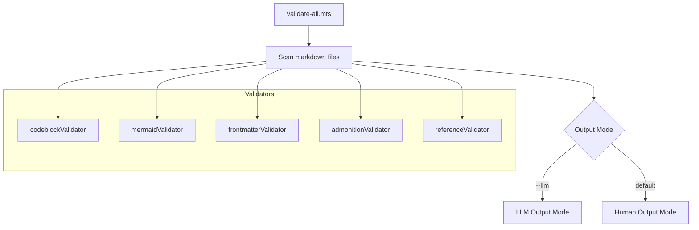
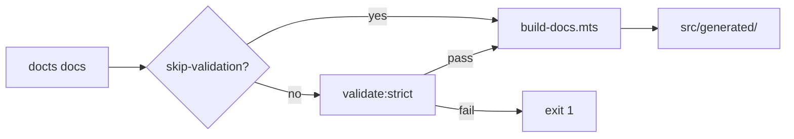

# Validation System

The validation system scans all markdown files in the `docs/` and `blog/` directories and runs a suite of validators to ensure content quality, structural correctness, and completeness.

## Running Validation

```bash:desc=Validation commands
bun run validate          # Human-readable output
bun run validate:strict   # Exit code 1 on strict failures
bun run validate:stats    # Summary statistics only
bun run validate:llm      # LLM-friendly action items
```

These map to the underlying script:

```bash:desc=Underlying validation script commands
bun run scripts/validate-all.mts           # All validators, human output
bun run scripts/validate-all.mts --strict  # Exit 1 on strict failures
bun run scripts/validate-all.mts --stats   # Summary only
bun run scripts/validate-all.mts --llm     # LLM action items format
```

## Validator Architecture



## Registered Validators

Validators are registered in `scripts/plugins/validators/index.ts`:

```typescript:desc=Validator registry definition
export const validators: MarkdownValidator[] = [
  codeblockValidator,    // STRICT
  mermaidValidator,      // STRICT
  frontmatterValidator,  // NOT strict
  admonitionValidator,   // NOT strict
  referenceValidator,    // STRICT
];
```

| Validator | Label | Strict | Purpose |
|-----------|-------|--------|---------|
| `codeblockValidator` | Code Block Validator | Yes | Ensures code blocks have descriptions and language labels |
| `mermaidValidator` | Mermaid Validator | Yes | Validates mermaid diagram syntax and structure |
| `frontmatterValidator` | Frontmatter Validator | No | Validates frontmatter fields and exposes data |
| `admonitionValidator` | Admonition Validator | No | Checks admonition usage and types |
| `referenceValidator` | Reference Validator | Yes | Validates references and footnotes |

## Interfaces

### MarkdownValidator

The interface that all validators must implement:

```typescript:desc=Validator registry definition
export interface MarkdownValidator {
  /** Unique validator name */
  name: string;

  /** Human-readable label for display */
  label: string;

  /** Validate a single markdown file */
  validate(content: string, filePath: string): ValidationResult;

  /** Whether validation should fail the build */
  isStrict?: boolean;
}
```

### ValidationResult

What each validator returns:

```typescript:desc=Validator registry definition
export interface ValidationResult {
  /** Number of items checked */
  checked: number;
  /** Issues found */
  issues: ValidationIssue[];
  /** Statistics for reporting */
  stats?: Record<string, number>;
}
```

### ValidationIssue

Individual issue details:

```typescript:desc=Validator registry definition
export type ValidationSeverity = "error" | "warning" | "info";

export interface ValidationIssue {
  severity: ValidationSeverity;
  file: string;
  line?: number;
  message: string;
  detail?: string;
}
```

## Output Modes

### Human Mode (Default)

Provides colored terminal output with badges, per-validator sections, and issue details:

```:desc=Human mode validation output example
────────────────────────────────────────────────────────────────────────────────
  [icon]  Code Block Validator
═══════════════════════════════════════════════════════════════════════════════

  [ERROR]  docs/01-getting-started/01-introduction.md:42
           Code block missing description
           → Add :desc=... after the language identifier

────────────────────────────────────────────────────────────────────────────────
  Files checked:      24
  Total issues:       3
    Errors:           1
    Warnings:         2
    Info:             0
  Status:             FAIL
```

Per-validator summary table with PASS/FAIL status:

```:desc=Validator summary table example
Code Block Validator     ✓ PASS   (clean)
Mermaid Validator        ✗ FAIL   (strict)  (1 errors, 0 warnings, 0 info)
Frontmatter Validator    ✓ PASS   (clean)
Admonition Validator     ✓ PASS   (strict clean)
Reference Validator      ✓ PASS   (clean)
```

### Stats Mode (`--stats`)

Shows only the summary statistics without individual issue details:

```:desc=Stats mode output example
Code Block Validator     ✓ PASS   (clean)
Mermaid Validator        ✓ PASS   (clean)
...
```

### LLM Mode (`--llm`)

Outputs structured markdown with action items organized by priority. Designed for automated agents:

```markdown:desc=LLM mode output example
<!-- VALIDATION_START -->
<!-- VALIDATION_START -->

## Validation Results

### Status

- **Total files scanned:** 24
- **Total issues found:** 3
- **Errors (must fix):** 1
- **Warnings (should fix):** 2
- **Info (consider fixing):** 0
- **Strict validation:** PASSED

### Recommended Actions for LLM-Code-Agent

#### HIGH PRIORITY (Must Fix)

**1 action(s)** - These will cause build failures or affect content quality.

**Action:** fix_error
**Affected files:** 1

  01-getting-started:
    - `docs/01-getting-started/01-introduction.md`

**Reason:** Code block missing description
**How to fix:** Add :desc=... after the language identifier

#### MEDIUM PRIORITY (Should Fix)
...
```

Issues are categorized with priority levels:

| Priority | Severity | Action | Effort |
|----------|----------|--------|--------|
| HIGH | error | `fix_error` | quick |
| MEDIUM | warning | `address_warning` | moderate |
| LOW | info | `consider_enhancement` | moderate |

## Strict Mode

When `--strict` is passed, the script exits with code 1 if any strict validator has errors:

```bash:desc=Strict mode validation command
bun run scripts/validate-all.mts --strict
# Exit code 1 if codeblockValidator, mermaidValidator, or referenceValidator found errors
```

Strict validators are those with `isStrict: true` in their definition. These are typically structural checks that would affect the build output.

## Mermaid.js Validation Constraints (Advisory)

It is important to note that **Mermaid.js build-time validation is advisory**.

The project uses a pure-TypeScript heuristic parser at build-time to catch common syntax errors without requiring a heavy browser environment. However:

1. **Heuristics vs. Real Parser:** The build-time rules may be incomplete or outdated compared to the official Mermaid.js engine running in the browser.
2. **False Positives/Negatives:** A diagram may pass build-time validation but still fail to render in the React frontend, or vice-versa.
3. **Always Verify:** Successful build-time validation **does not guarantee** a correctly rendered diagram. Authors must always verify the final output in the browser.

When a diagram fails build-time validation, an advisory warning is displayed in the build report and the document UI.

## Colored Terminal Output

The validation script uses a comprehensive color system for terminal output:

| Element | Color | Style |
|---------|-------|-------|
| Headers | Cyan | Bright |
| Section dividers | Magenta | Bold (═) |
| Error badges | Red | Bright `[ERROR]` |
| Warning badges | Yellow | Bright `[WARN]` |
| Info badges | Cyan | Bright `[INFO]` |
| PASS status | Green | Bright `✓ PASS` |
| FAIL status | Red | Bright `✗ FAIL` |
| File paths | Gray | Dim |
| Issue details | White | Normal |
| Details/hints | Gray | Dim with `→` prefix |

## Integration with Build Pipeline

Validation is integrated into the CLI's build process:

- **Dev mode** (`docts dev`): Skips validation for rapid iteration
- **Build mode** (`docts build`): Runs through Biome lint checks, but not content validation by default
- **Docs mode** (`docts docs`): Runs `validate:strict` before regenerating docs (unless `--skip-validation` is passed)
- **CI/CD**: Use `bun run validate:strict` to enforce content quality gates



## Adding Custom Validators

To add a new validator, implement the `MarkdownValidator` interface and register it in `scripts/plugins/validators/index.ts`:

```typescript:desc=Validator registry definition
import type { MarkdownValidator, ValidationResult } from "./types.ts";

export const myValidator: MarkdownValidator = {
  name: "my-validator",
  label: "My Validator",
  isStrict: false,  // Set true to fail build on errors
  validate(content: string, filePath: string): ValidationResult {
    const issues: ValidationIssue[] = [];
    let checked = 0;

    // ... validation logic ...

    return { checked, issues };
  },
};
```

Then add it to the registry:

```typescript:desc=Validator registry definition
export const validators: MarkdownValidator[] = [
  codeblockValidator,
  mermaidValidator,
  frontmatterValidator,
  admonitionValidator,
  referenceValidator,
  myValidator,  // Add here
];
```

## Related

- [CLI Reference](/docs/guides/cli-reference) -- `--skip-validation` and `--strict` flags
- [Writing Plugins](/docs/guides/writing-plugins) -- plugin validators vs build plugins
- [SEO Optimization](/docs/guides/seo-optimization) -- frontmatter validation for SEO fields
