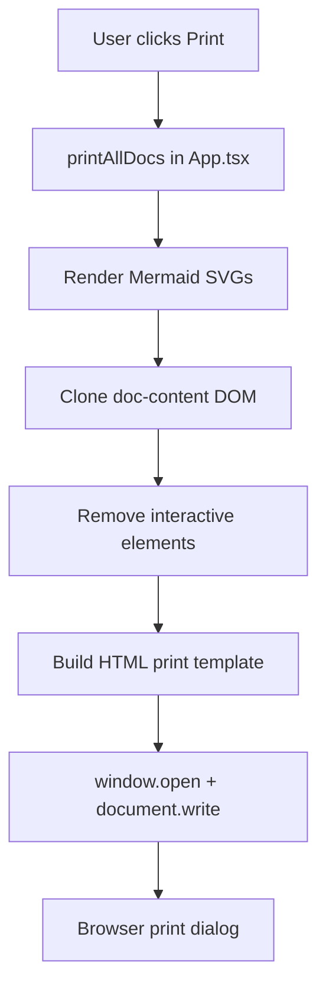
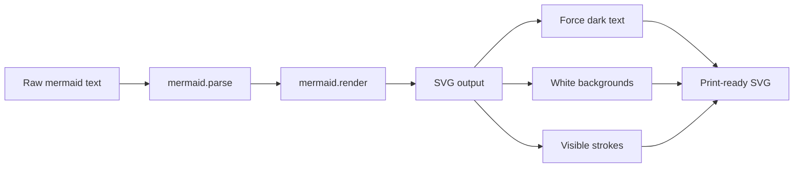

# Print Export

The documentation site supports two print modes: **browser print** (via `window.print()`) and a **dedicated print view** that renders all documents into a single printable page. Both modes handle Mermaid diagrams, MathJax formulas, and code blocks correctly.

## Print Architecture



## printAllDocs Function

Located in `src/App.tsx`, `printAllDocs` is triggered by the print button in the top bar:

```typescript:desc=printAllDocs function implementation
const printAllDocs = async () => {
  // 1. Render all mermaid diagrams as SVGs
  // 2. Clone the DOM content
  // 3. Clean interactive elements
  // 4. Build HTML template with print-friendly theme
  // 5. Open new window and write content
  // 6. Trigger window.print()
};
```

### Step 1: Render Mermaid Diagrams

Before print, all Mermaid diagrams must be rendered from their raw text source into SVGs. The function:

1. Finds all `.mermaid-diagram[data-processed='false']` elements
2. Dynamically imports and initializes mermaid with print-friendly settings:

```typescript:desc=Mermaid initialization for print
const { default: mermaid } = await import("mermaid");
mermaid.initialize({
  startOnLoad: false,
  theme: "neutral",                    // Light, readable theme
  securityLevel: "loose",
  fontFamily: "system-ui, -apple-system, sans-serif",
});
```

3. Iterates through each diagram wrapper:
   - Parses the diagram source with `mermaid.parse()`
   - Renders with `mermaid.render()` to generate SVG
   - Sets `data-processed="true"` to mark as done
   - Injects SVG into the `.mermaid` element

4. **Forces print readability**: After rendering, modifies SVG elements:
   - Text elements: `fill: "#1a1a1a"` (dark text)
   - Shapes with transparent/missing strokes: `stroke: "#374151"` (dark gray)
   - Filled shapes (non-white fills): `fill: "#ffffff"` (white background)
   - All shapes: `stroke: "#6b7280"` (visible border)



### Step 2: Clone DOM Content

The function clones the `.doc-content` element to avoid modifying the live page:

```typescript:desc=DOM clone for print
const docContentEl = document.querySelector(".doc-content");
const clone = docContentEl.cloneNode(true) as HTMLElement;
```

### Step 3: Clean Interactive Elements

Removes elements that shouldn't appear in print:

```typescript:desc=Remove interactive elements for print
clone.querySelectorAll(
  ".code-copy-btn, .mermaid-zoom-btn, .mermaid-download-btn"
).forEach(el => el.remove());

clone.querySelectorAll(".code-header").forEach(el => {
  (el as HTMLElement).style.display = "none";
});
```

| Removed Element | Reason |
|-----------------|--------|
| `.code-copy-btn` | Interactive, no function in print |
| `.mermaid-zoom-btn` | Interactive, no function in print |
| `.mermaid-download-btn` | Interactive, no function in print |
| `.hash-link` | Permalink anchors, clutter print |
| `.code-header` | Language labels redundant in print |

### Step 4: Build HTML Print Template

The function creates a complete HTML document with:

- **@page rules**: A4 size, 2cm/1.8cm margins
- **Paper-like white theme**: All CSS custom properties set to white-paper values
- **Print-specific page-break rules**: Avoid breaks inside code blocks, admonitions, diagrams, tables
- **Serif font**: Georgia/Palatino for print readability

```css:desc=Print page CSS rules
@page {
  margin: 2cm 1.8cm;
  size: A4;
}

@media print {
  .doc-section { page-break-after: always; }
  .doc-section:last-child { page-break-after: avoid; }
  .code-block, .admonition, .mermaid-diagram, table, img {
    page-break-inside: avoid;
  }
  h1, h2, h3 { page-break-after: avoid; }
}
```

### Step 5: Open and Print

Uses the `blob + window.open` approach:

```typescript:desc=Open print window
const printWindow = window.open("", "_blank");
printWindow.document.write(printHtml);
printWindow.document.close();
// User triggers browser print dialog from the new window
```

## Print Media Styles

`src/styles/print-media.css` provides `@media print` rules for the browser's native print:

```css:desc=Print media CSS styles
@media print {
  /* Hide all UI elements */
  .top-bar, .sidebar, .toc-container, .scroll-panel,
  .breadcrumbs, .doc-footer, .scroll-to-top-btn, .print-btn,
  .font-switcher, .theme-toggle, .menu-btn, .toc-mobile-collapsible {
    display: none !important;
  }

  /* Code blocks print-friendly */
  .code-block {
    break-inside: avoid;
    border: 1px solid #ccc;
    page-break-inside: avoid;
  }

  .code-header {
    background: #f5f5f5 !important;
    border-bottom: 1px solid #ccc;
    -webkit-print-color-adjust: exact;
    print-color-adjust: exact;
  }

  .code-copy-btn {
    display: none !important;
  }

  .doc-content .code-block pre {
    background: #fafafa !important;
    -webkit-print-color-adjust: exact;
    print-color-adjust: exact;
  }

  /* Links show URL */
  .doc-content a[href^="http"]::after {
    content: " (" attr(href) ")";
    font-size: 0.75em;
    color: #666;
  }

  /* Mermaid diagrams */
  .mermaid-diagram {
    break-inside: avoid;
  }
}
```

## Hidden Elements in Print

The following elements are hidden during print:

| Category | Elements |
|----------|----------|
| Navigation | `.top-bar`, `.sidebar`, `.breadcrumbs`, `.menu-btn` |
| TOC | `.toc-container`, `.toc-mobile-collapsible` |
| Interactive | `.scroll-to-top-btn`, `.print-btn`, `.font-switcher`, `.theme-toggle` |
| Code blocks | `.code-copy-btn`, `.code-header` |
| Mermaid | `.mermaid-zoom-btn`, `.mermaid-download-btn` |
| Footer | `.doc-footer` |

## Code Block Print Styling

Code blocks receive special treatment for print:

- **Background**: Light gray (`#fafafa`) instead of dark theme
- **Border**: 1px solid `#ccc` to define boundaries
- **Line numbers**: Gray (`#888`) for readability
- **Header**: Hidden entirely to reduce clutter
- **Copy button**: Hidden
- **Page break**: `break-inside: avoid` to keep blocks on one page
- **Color adjust**: `print-color-adjust: exact` preserves syntax colors if user enables "Background graphics"

## Mermaid Print Readability

Mermaid diagrams are specially processed for print:

1. **Theme**: Rendered with `"neutral"` theme (light background, dark text)
2. **Text**: All text forced to `#1a1a1a` (near-black)
3. **Shapes**: White backgrounds with visible gray borders
4. **Scaling**: `max-width: 100%` to fit page width
5. **Page break**: `break-inside: avoid` to keep diagrams on one page

## Print View CSS

`src/styles/print-view.css` provides styling for the dedicated print preview window:

```css:desc=Print view CSS
.print-view {
  min-height: 100vh;
  padding: 2rem;
  max-width: 800px;
  margin: 0 auto;
  background: var(--bg);
  color: var(--text);
  font-family: inherit;
  line-height: 1.6;
}
```

Includes a print header with close button, a multi-column TOC grid, and document sections.

## Related

- [CSS & Theme Architecture](/docs/guides/css-theme-architecture) -- print-media.css and print-view.css
- [React Hooks](/docs/guides/react-hooks) -- hooks used in the print UI
- [Writing Plugins](/docs/guides/writing-plugins) -- mermaid plugin generates diagram containers
