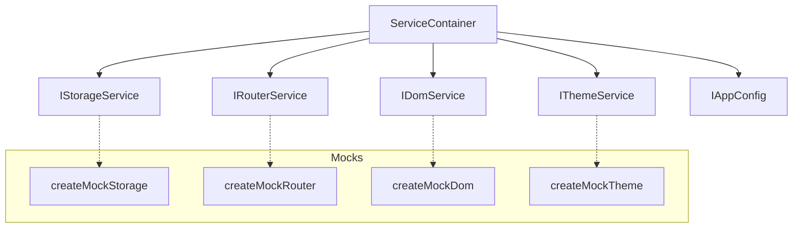

# Testing Strategy

The project uses **Bun's built-in test runner** with **Testing Library** for component tests and plain assertions for service/pipeline tests. The test suite covers UI components, services, the build pipeline, and edge cases.

## Test Structure

```:desc=Test directory structure
tests/
├── setup.ts                    # Global test setup
├── test-utils.tsx              # renderWithServices, mock data
├── app.test.tsx                # App component tests
├── sidebar.test.tsx            # Sidebar component tests
├── docviewer.test.tsx          # DocViewer component tests
├── breadcrumbs.test.tsx        # Breadcrumbs component tests
├── error-boundary.test.tsx     # ErrorBoundary component tests
├── table-of-contents.test.tsx  # TOC component tests
├── docfooter.test.tsx          # DocFooter component tests
├── di-provider.test.tsx        # DI Provider tests
├── services.test.ts            # Service container tests
├── mocks.test.ts               # Mock service tests
├── build-pipeline.test.ts      # Build pipeline tests
├── mermaid-validation.test.ts  # Mermaid validation tests
├── diagnostics.test.ts         # Diagnostics system tests
├── generated-output.test.ts    # Generated output tests
└── edge-cases.test.ts          # Edge case tests
```

**17 test files** covering all major parts of the system.

## Running Tests

```bash:desc=Test running commands
bun run test              # Run all tests once
bun run test:watch        # Watch mode -- re-runs on file changes
bun run test:coverage     # With coverage report (coverage/index.html)

# Via CLI directly
docts test                # Run tests
docts test --watch        # Watch mode
docts test --coverage     # Coverage report
```

## Test Utilities

### renderWithServices

The primary utility for testing React components. It wraps components with the DI provider using mock services:

```typescript:desc=TypeScript code example
// tests/test-utils.tsx

export function renderWithServices(
  ui: ReactNode,
  options: TestRenderOptions = {}
): RenderResult & { services: ServiceContainer } {
  const storage = createMockStorage();
  const container = createContainer({
    storage,
    router: createMockRouter(),
    dom: createMockDom(),
    ...options.containerOptions,
  });
  container.theme = createMockTheme(storage);

  function Wrapper({ children }: { children: ReactNode }) {
    return <ServicesProvider container={container}>{children}</ServicesProvider>;
  }

  const result = render(ui, { wrapper: Wrapper, ...options.renderOptions });
  return { ...result, services: container };
}
```

**Key features:**

- Creates a fresh DI container with all mock services for each test
- Returns the `ServiceContainer` so tests can inspect/modify service state
- Supports overriding specific services via `containerOptions`
- Re-exports `screen` and `cleanup` from Testing Library

### Mock Data

Pre-built mock data for common test scenarios:

```typescript:desc=TypeScript code example
export const mockDocEntry = {
  id: "test/doc",
  slug: "test/doc",
  title: "Test Document",
  description: "A test document",
  sidebar_label: "Test Doc",
  sidebar_position: 1,
  section: "docs",
  category: "test",
  content: "<h1>Test Document</h1><p>Test content</p>",
  toc: [
    { value: "Test Document", id: "test-document", level: 1 },
    { value: "Section One", id: "section-one", level: 2 },
    { value: "Section Two", id: "section-two", level: 2 },
  ],
};

export const mockSidebarData = [
  {
    type: "category",
    label: "Test Category",
    link: { type: "doc", id: "test/doc" },
    items: [
      { type: "doc", id: "test/doc", label: "Test Doc", slug: "test/doc" },
      { type: "doc", id: "test/doc-two", label: "Test Doc Two", slug: "test/doc-two" },
    ],
  },
];
```

## Mock Services

The DI system (`src/services/container.ts`) defines 5 service interfaces that can be swapped for testing:



| Interface | Mock | Purpose |
|-----------|------|---------|
| `IStorageService` | `createMockStorage()` | In-memory key-value store |
| `IRouterService` | `createMockRouter()` | Tracks current path and navigation history |
| `IDomService` | `createMockDom()` | Mock DOM queries and scroll operations |
| `IThemeService` | `createMockTheme()` | Deterministic theme state management |
| `IAppConfig` | `createAppConfig()` | Fixed configuration values |

### Example: Mock Storage Service

```typescript:desc=TypeScript code example
export function createMockStorage(): IStorageService {
  const store = new Map<string, string>();
  return {
    getItem: (key) => store.get(key) ?? null,
    setItem: (key, value) => { store.set(key, value); },
    removeItem: (key) => { store.delete(key); },
    clear: () => { store.clear(); },
  };
}
```

## Component Tests

Component tests use Testing Library queries and user interactions:

```typescript:desc=TypeScript code example
import { renderWithServices, screen } from "./test-utils";
import { Sidebar } from "../src/components/Sidebar";

test("renders sidebar with categories", () => {
  renderWithServices(<Sidebar data={mockSidebarData} />);
  expect(screen.getByText("Test Category")).toBeInTheDocument();
  expect(screen.getByText("Test Doc")).toBeInTheDocument();
});
```

### Tested Components

| Component | Test File | Key Scenarios |
|-----------|-----------|---------------|
| `App` | `app.test.tsx` | Route handling, theme integration, navigation |
| `Sidebar` | `sidebar.test.tsx` | Category rendering, item selection, collapse/expand |
| `DocViewer` | `docviewer.test.tsx` | Content rendering, TOC generation, mermaid display |
| `Breadcrumbs` | `breadcrumbs.test.tsx` | Path generation, link rendering |
| `ErrorBoundary` | `error-boundary.test.tsx` | Error catching, fallback UI, reset |
| `TableOfContents` | `table-of-contents.test.tsx` | Heading extraction, active tracking |
| `DocFooter` | `docfooter.test.tsx` | Prev/next navigation, disabled states |
| `ServicesProvider` | `di-provider.test.tsx` | DI context provision, service access |

## Service Tests

Tests for the DI container and service implementations:

```typescript:desc=TypeScript code example
// tests/services.test.ts

test("createContainer returns all services", () => {
  const container = createContainer();
  expect(container.storage).toBeDefined();
  expect(container.router).toBeDefined();
  expect(container.dom).toBeDefined();
  expect(container.theme).toBeDefined();
  expect(container.config).toBeDefined();
});

test("theme service persists to storage", () => {
  const storage = createMockStorage();
  const theme = createThemeService(storage);
  theme.applyTheme(true);
  // Verify storage was updated
});
```

## Build Pipeline Tests

Tests for the markdown processing pipeline:

```typescript:desc=TypeScript code example
// tests/build-pipeline.test.ts

test("plugins transform markdown correctly", () => {
  // Verify preProcess order
  // Verify postProcess reverse order
  // Verify sentinel replacement
});

test("generated output matches expected structure", () => {
  // Verify sidebar.ts shape
  // Verify doc entry structure
});
```

## Mermaid Validation Tests

Tests for the mermaid content validator:

```typescript:desc=TypeScript code example
// tests/mermaid-validation.test.ts

test("validates valid mermaid syntax", () => {
  const errors = validateMermaidContent("graph TD\n  A --> B");
  expect(errors).toHaveLength(0);
});

test("detects invalid mermaid syntax", () => {
  const errors = validateMermaidContent("invalid graph");
  expect(errors.length).toBeGreaterThan(0);
});
```

## Edge Case Tests

Tests for boundary conditions and error handling:

```typescript:desc=TypeScript code example
// tests/edge-cases.test.ts

test("handles empty markdown content", () => { /* ... */ });
test("handles malformed frontmatter", () => { /* ... */ });
test("handles deeply nested structures", () => { /* ... */ });
test("handles missing services gracefully", () => { /* ... */ });
```

## Diagnostics Tests

Tests for the diagnostic system used by the build pipeline:

```typescript:desc=TypeScript code example
// tests/diagnostics.test.ts

test("collects errors and warnings", () => {
  const diags = new Diagnostics();
  diags.error("test", "file.md", "Test error");
  diags.warn("test", "file.md", "Test warning");
  const summary = diags.summary();
  expect(summary.errors).toBe(1);
  expect(summary.warnings).toBe(1);
});
```

## Testing Best Practices

1. **Always use `renderWithServices`**: Components depend on the DI context -- use the wrapper
2. **Test behavior, not implementation**: Assert on rendered output and user interactions, not internal state
3. **Use mock services**: Never test against real `localStorage` or `window.history`
4. **Test edge cases**: Empty content, missing data, extreme values
5. **Isolate tests**: Each test gets a fresh DI container -- no cross-test pollution
6. **Use `screen` queries**: Prefer `getBy*`, `queryBy*`, `findBy*` over direct DOM access
7. **Test service contracts**: Verify that services implement their interfaces correctly

## Coverage

When running `bun run test:coverage`, the coverage report is generated at `coverage/index.html`. Key files to monitor:

| Area | Expected Coverage |
|------|-------------------|
| `src/hooks/` | High (pure logic, easy to test) |
| `src/services/` | High (mockable, deterministic) |
| `src/components/` | Medium-High (UI interaction testing) |
| `scripts/plugins/` | Medium (string transformation, harder to assert) |
| `scripts/plugins/validators/` | High (validatable input/output) |

## Related

- [CLI Reference](/docs/guides/cli-reference) -- `docts test` command and flags
- [React Hooks](/docs/guides/react-hooks) -- hooks tested in component tests
- [Dependency Injection](/docs/architecture/dependency-injection) -- mock service patterns
