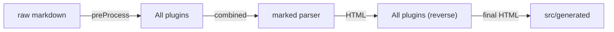
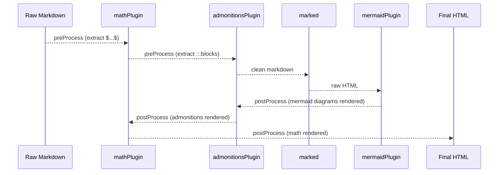

# Writing Plugins

The markdown plugin system allows you to extend the build pipeline with custom transformations. Plugins can modify markdown before it's parsed (preProcess) and transform the HTML output after parsing (postProcess).

## Plugin Interface

```typescript:desc=TypeScript code example
// scripts/plugins/types.ts

export interface MarkdownPlugin {
  /** Unique plugin name */
  name: string;

  /**
   * Run BEFORE marked converts markdown to HTML.
   * Use this to transform markdown syntax into something else,
   * or to inject custom markdown syntax.
   */
  preProcess?(md: string): string;

  /**
   * Run AFTER marked converts markdown to HTML.
   * Use this to transform HTML output, replace code blocks,
   * or inject scripts/styles.
   */
  postProcess?(html: string): string;
}
```

## Build Pipeline



The full pipeline:

```:desc=Build pipeline overview
raw .md → preProcess (plugins in order) → marked → postProcess (plugins in REVERSE order) → docs-data.ts
```

### Execution Order

| Phase | Order | Reason |
|-------|-------|--------|
| `preProcess` | Plugin order | Later plugins see output of earlier ones |
| `postProcess` | **Reverse** order | Last plugin runs first on HTML output |

With the default plugin registry (`math` → `admonitions` → `mermaid`):

```:desc=Plugin execution order example
preProcess:  math → admonitions → mermaid (identity)
postProcess: mermaid → admonitions → math
```

The reverse order in postProcess is critical: admonition content may contain math sentinels, so math must be resolved last (in reverse: first).

## Registered Plugins

```typescript:desc=TypeScript code example
// scripts/plugins/index.ts

export const plugins: MarkdownPlugin[] = [mathPlugin, admonitionsPlugin, mermaidPlugin];
```

| Plugin | Phase | Purpose |
|--------|-------|---------|
| `mathPlugin` | pre + post | Protects LaTeX from marked, restores as MathJax delimiters |
| `admonitionsPlugin` | pre + post | Converts `:::type` blocks to styled HTML |
| `mermaidPlugin` | post only | Transforms mermaid code blocks into diagram containers |

## Plugin Execution Flow



## The Sentinel Pattern

Both `mathPlugin` and `admonitionsPlugin` use the sentinel pattern:

1. **preProcess**: Find special syntax, replace with unique placeholder (sentinel), store original data
2. **marked**: Parser processes the clean markdown (sentinels pass through unchanged)
3. **postProcess**: Replace sentinels with final HTML

### Sentinel Format

Sentinels follow the pattern: `PLUGIN_TYPE{index}END`

```:desc=Sentinel format examples
MATHINLINE0END       → Inline math
MATHDISPLAY1END      → Display math
ADMONITION0END       → Admonition block
MERMAIDBLOCK0END     → Mermaid diagram
```

### Why Sentinels?

- Prevents marked from interpreting special syntax
- Allows multi-line content to pass through safely
- Enables HTML generation in postProcess with full context
- Avoids markdown-to-HTML conflicts

## Step-by-Step: Creating a New Plugin

### Step 1: Define the Plugin

Create a new file in `scripts/plugins/`, e.g., `scripts/plugins/toc-marker.ts`:

```typescript:desc=TypeScript code example
import type { MarkdownPlugin } from "./types.ts";

interface TocMarkerBlock {
  id: string;
  markerType: string;
}

const blocks: TocMarkerBlock[] = [];

export const tocMarkerPlugin: MarkdownPlugin = {
  name: "toc-marker",

  preProcess(md: string): string {
    blocks.length = 0;
    let index = 0;

    const lines = md.split("\n");
    let inCodeBlock = false;
    const resultLines: string[] = [];

    for (let i = 0; i < lines.length; i++) {
      const line = lines[i];

      if (line.trimStart().startsWith("```")) {
        inCodeBlock = !inCodeBlock;
        resultLines.push(line);
        continue;
      }

      if (inCodeBlock) {
        resultLines.push(line);
        continue;
      }

      // Match [toc-marker:type] syntax
      const match = line.match(/^\[toc-marker:(\w+)\]$/);
      if (match) {
        const id = `TOCMARKER${index++}END`;
        blocks.push({ id, markerType: match[1] });
        resultLines.push(id);
        continue;
      }

      resultLines.push(line);
    }

    return resultLines.join("\n");
  },

  postProcess(html: string): string {
    if (blocks.length === 0) return html;

    let result = html;

    for (const block of blocks) {
      const markerHtml = `<div class="toc-marker" data-type="${block.markerType}"></div>`;

      const wrappedRegex = new RegExp(`<p>\\s*${block.id}\\s*<\\/p>`, "g");
      if (wrappedRegex.test(result)) {
        result = result.replace(wrappedRegex, markerHtml);
      } else {
        const looseRegex = new RegExp(`\\s*${block.id}\\s*`, "g");
        result = result.replace(looseRegex, markerHtml);
      }
    }

    return result;
  },
};
```

### Step 2: Register the Plugin

Add it to `scripts/plugins/index.ts`:

```typescript:desc=TypeScript code example
import { tocMarkerPlugin } from "./toc-marker.ts";

export const plugins: MarkdownPlugin[] = [mathPlugin, admonitionsPlugin, tocMarkerPlugin, mermaidPlugin];
```

Place it in the correct position based on dependencies:
- If your plugin's preProcess output should be processed by another plugin, place it **before** that plugin
- If your plugin's postProcess depends on another plugin's output, place it **before** that plugin (it runs later in reverse)

### Step 3: Add CSS (if needed)

If your plugin generates HTML that needs styling, add CSS to the appropriate file in `src/styles/`:

```css:desc=CSS for toc-marker plugin
/* admonitions.css or new file */
.toc-marker {
  border-left: 3px solid var(--ifm-color-primary);
  padding-left: 1rem;
  margin: 1rem 0;
}
```

### Step 4: Test

Build the docs and verify the output:

```bash:desc=Test commands for plugin development
bun run build:docs    # Regenerate src/generated/
bun run dev           # Preview in browser
```

## How Existing Plugins Work

### mathPlugin

**File:** `scripts/plugins/math.ts`

- **preProcess**: Walks lines, skips code blocks, extracts `$...$` and `$$...$$` into sentinels
- **postProcess**: Replaces sentinels with `<span class="math-inline">\(tex\)</span>` or `<div class="math-display">\[tex\]</div>`
- **Key detail**: Handles multi-line display math (opening/closing `$$` on separate lines)

### admonitionsPlugin

**File:** `scripts/plugins/admonitions.ts`

- **preProcess**: Walk lines, skips code blocks, collects content between `:::type` and `:::` markers
- **postProcess**: Passes collected content through `marked.parse()` for rich HTML, wraps in `<div class="admonition admonition-{type}">`
- **Key detail**: Handles `<p>SENTINEL</p>` unwrapping (marked wraps block-level replacements in `<p>` tags)
- **Supported types**: `note`, `tip`, `info`, `warning`, `danger`, `caution`

### mermaidPlugin

**File:** `scripts/plugins/mermaid.ts`

- **preProcess**: Identity pass (returns input unchanged)
- **postProcess**: Finds mermaid code blocks in HTML output, extracts diagram source, replaces with `<div class="mermaid-diagram">` containers
- **Key detail**: Decodes HTML entities back to original diagram text, strips Shiki `<span>` tags
- **Key detail**: Validates diagram content before rendering (via `validateMermaidContent()`)
- **Features**: Zoom button, download button, description display, error containers

## Plugin Best Practices

1. **Guard against empty input**: Always check `if (blocks.length === 0) return html;` in postProcess
2. **Track code block state**: Use `inCodeBlock` flag to avoid processing syntax inside code fences
3. **Use unique sentinels**: Include an incrementing index to handle multiple occurrences
4. **Handle `<p>` wrapping**: marked wraps block-level replacements in `<p>` tags -- strip them in postProcess
5. **Isolate state**: Clear the blocks array at the start of each preProcess call
6. **Use `String.split().join()` for replacement**: Safer than regex when sentinels contain special characters
7. **Escape HTML in stored data**: Use `escapeHtml()` when embedding raw content in HTML attributes

## Related

- [CLI Reference](/docs/03-guides/01-cli-reference) -- `docts build` runs the plugin pipeline
- [Validation System](/docs/03-guides/05-validation-system) -- validators vs plugins
- [CSS & Theme Architecture](/docs/03-guides/02-css-theme-architecture) -- styling plugin output
