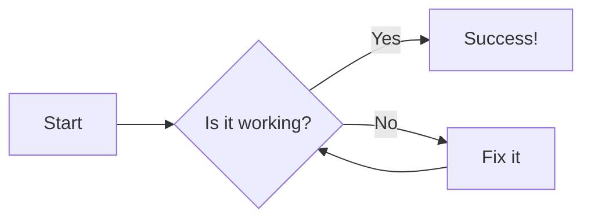
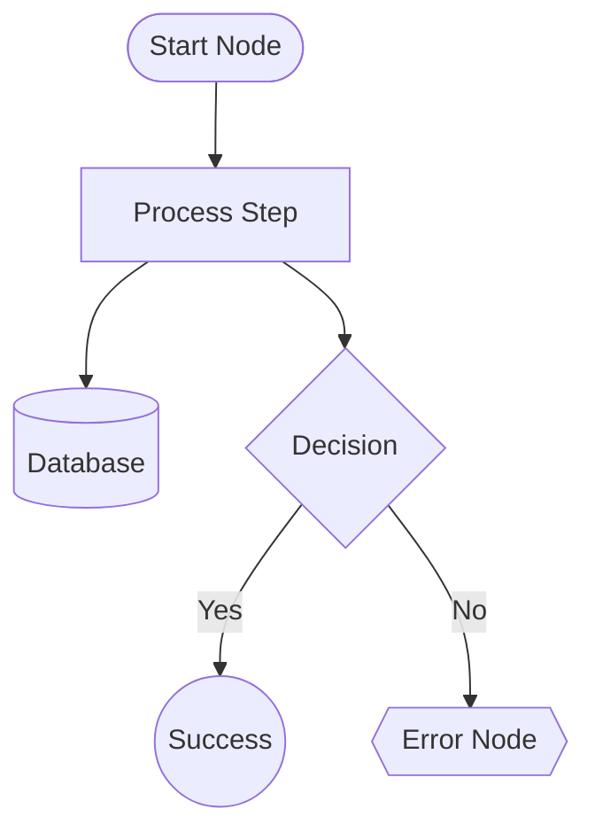
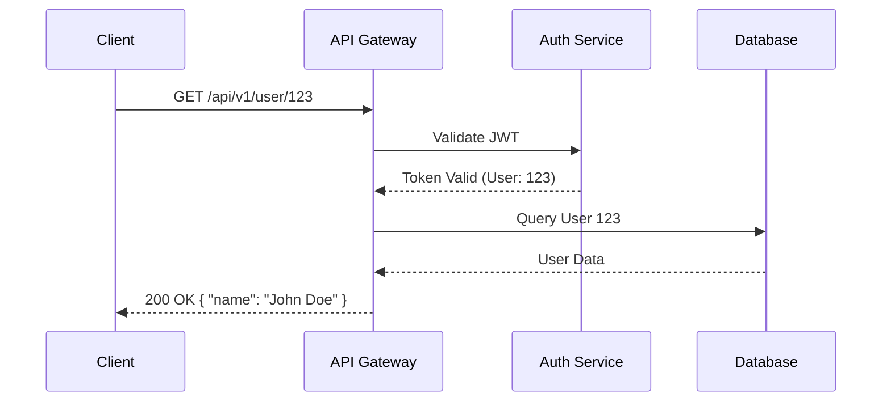
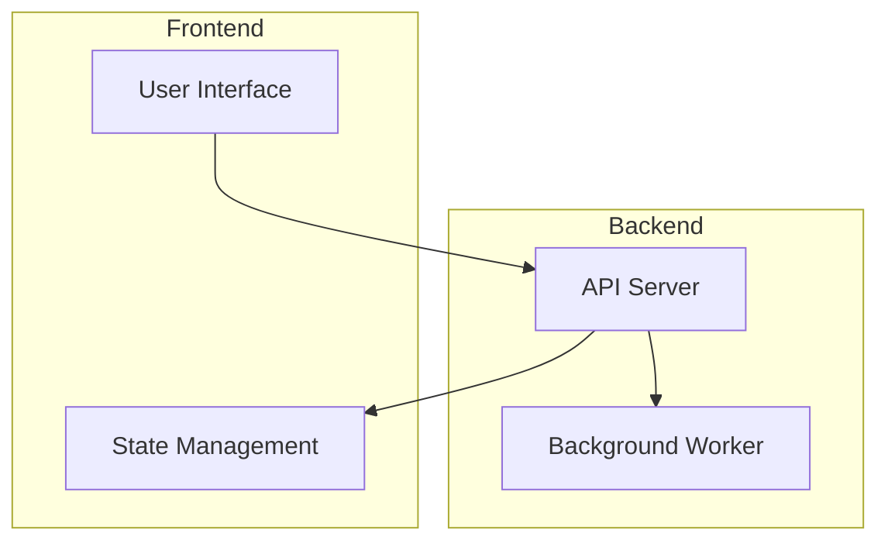
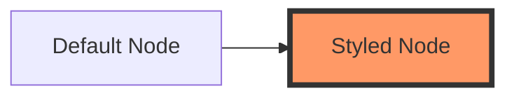

# Mastering Mermaid Diagrams

Mermaid.js allows you you to create complex, interactive diagrams directly within your Markdown using a simple, text-based syntax. This approach ensures your diagrams are version-controlled, easy to edit, and perfectly integrated into the documentation theme.

## 1. The Basics: Flowcharts

Flowcharts are the most versatile diagram type. They are perfect for showing processes, decision paths, and organizational structures.

### Directional Control

You can control the flow of your diagram by specifying a direction at the start:

- `TD` or `TB`: Top Down
- `BT`: Bottom Up
- `LR`: Left to Right
- `RL`: Right to Left

### Node Shapes

Mermaid supports various shapes for your nodes:

- `[Square]` - Default
- `(Rounded)` - Rounded corners
- `([Stadium])` - Stadium shape
- `[[Subroutine]]` - Double borders
- `[(Database)]` - Cylinder shape
- `{{Hexagon}}` - Hexagon
- `((Circle))` - Circle
- `>Asymmetric<` - Asymmetric shape

## 2. Sequence Diagrams

Sequence diagrams are ideal for showing the interaction between different components or services over time. They are particularly useful for explaining complex API calls or system architectures.

## 3. Advanced Features

### Subgraphs

Subgraphs allow you to group related nodes together, providing visual structure to complex diagrams.

### Styling Nodes

You can apply custom styles to your nodes using the `style` keyword.

## 4. Best Practices

1.  **Use Descriptive Labels**: Instead of `A[Node A]`, use `A[User Registration]`.
2.  **Keep it Simple**: If a diagram becomes too complex, break it into multiple smaller diagrams or use subgraphs.
3.  **Consistent Directions**: Stick to a consistent direction (e.g., all `LR` or all `TD`) within a single document for a cleaner look.
4.  **Leverage `:desc=`**: Always use the `:desc=` attribute on your code blocks. This provides a title in the UI and improves accessibility.
5.  **Test with Validation**: Use the built-in build-time validation to catch syntax errors early.

## Next Steps

- **[Writing Plugins](./01-writing-plugins)**: Learn how to create your own custom Markdown transformations.
- **[Build Pipeline](../architecture/01-build-pipeline)**: See how these diagrams are processed during the build.
