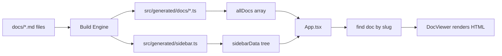

# Project Structure

This document provides a complete overview of the project directory tree and explains how raw documentation files are transformed into generated TypeScript data.

## Directory Tree

```:desc=Directory tree of the project
rspack-react-docs/
├── docs/                    # Markdown source files for documentation
├── scripts/                 # Bun (TypeScript) build tools and plugins
├── scripts-rs/              # Rust build engine and CLI implementation
├── src/                     # Frontend source code
│   ├── generated/           # Auto-generated data (DO NOT EDIT)
│   ├── hooks/               # Custom React hooks (theming, SEO, etc.)
│   ├── services/            # Dependency injection container
│   ├── styles/              # Modular CSS files
│   └── ...                  # React components (App, DocViewer, etc.)
├── tests/                   # Test suite (Bun test)
├── server/                  # Production server implementation
├── dist/                    # Final build output (generated by rspack)
├── rspack.config.ts         # rspack configuration
└── package.json             # Project metadata
```

## Generated Output (`src/generated/`)

The build pipeline scans all `.md` files in `docs/` and generates TypeScript data files. These files contain the entire documentation site as static data -- no runtime API calls are needed.

```:desc=Generated directory structure
src/generated/
├── index.ts          # Barrel export -- single entry point
├── sidebar.ts        # sidebarData tree structure
├── types.ts          # DocEntry interface definition
└── docs/             # One .ts file per markdown document
```

### The `DocEntry` Interface

Every documentation page is represented by a `DocEntry`:

| Field | Description |
|---|---|
| `id` | Unique identifier (equals `slug`) |
| `content` | HTML string (fully transformed with plugins) |
| `toc` | Table of contents headings |
| `metadata` | Arbitrary frontmatter fields |
| `ast` | Raw token array (for debugging) |

## Consumption Flow



## Hybrid Toolchain

The project uses a dual-tooling approach for maximum performance:

- **Bun**: Orchestrates development scripts, runs tests, and executes TypeScript-based plugins.
- **Rust**: Provides a high-performance build engine and CLI for heavy processing tasks.

For more details on the build process, see the [Build Pipeline](../architecture/build-pipeline).
