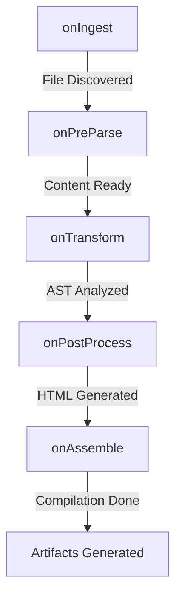

# Extending Markdown

The project provides a comprehensive system for extending and validating Markdown content via a **Compiler Middleware** architecture. This allows you to hook into the compilation lifecycle to inject custom features, perform deep validation, or transform output.

## Middleware Lifecycle

The transformation of Markdown to TypeScript occurs in five distinct lifecycle stages:



### The `CompilerMiddleware` Interface

To extend the system, create an object implementing one or more lifecycle hooks:

```typescript:desc=CompilerMiddleware interface
export interface CompilerMiddleware {
  name: string;
  onIngest?(unit: CompilationUnit, ctx: CompilationContext): void;
  onPreParse?(unit: CompilationUnit, ctx: CompilationContext): void;
  onTransform?(unit: CompilationUnit, ctx: CompilationContext): void;
  onPostProcess?(unit: CompilationUnit, ctx: CompilationContext): void;
  onAssemble?(units: CompilationUnit[], ctx: CompilationContext): void;
}
```

## Active Middlewares

| Middleware | Phase | Purpose |
| :--- | :--- | :--- |
| **Plugin System** | Pre/Post | Orchestrates legacy `preProcess` and `postProcess` plugins (Math, Admonitions). |
| **Mermaid Deep Validator** | Transform | Performs structural analysis on diagrams to prevent SVG corruption. |
| **Validation Layer** | Ingest/Assemble | Checks for path SEO, duplicate slugs, and broken internal links. |
| **TOC Extractor** | Transform | Uses the AST token stream to generate unique, deduplicated anchor IDs. |

## AST Analysis

The system exposes the raw `marked` tokens in the `onTransform` phase. This is the preferred way to perform deep analysis without the fragility of regular expressions.

### Example: Custom Syntax Checker
```typescript:desc=Middleware for detecting forbidden words
export const strictLanguageMiddleware: CompilerMiddleware = {
  name: "language-check",
  onTransform(unit, ctx) {
    unit.tokens?.forEach(token => {
      if (token.type === 'text' && token.text.includes('forbidden')) {
        ctx.error("content", unit.relPath, "Forbidden word detected", "Please use alternative terminology.");
      }
    });
  }
};
```

## Built-in Components

| Feature | Syntax | Lifecycle Hook |
| :--- | :--- | :--- |
| **Math** | `$E=mc^2$` | `onPreParse` (Sentinel extraction) |
| **Admonitions** | `:::note` | `onPreParse` (Block extraction) |
| **Diagrams** | ` ```mermaid ` | `onPostProcess` (Container injection) |
| **Timelines** | ` ```timeline ` | `onPostProcess` (Technical wrapper) |

## Related
- [Markdown Engine](/docs/02-architecture/04-markdown-engine) — Details on the stateful renderer.
- [Writing Plugins](/docs/03-guides/06-writing-plugins) — Tutorial on creating custom middleware.
