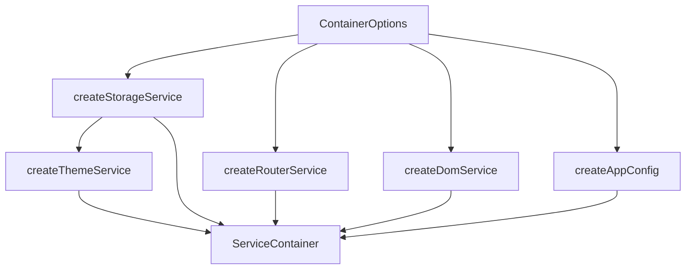
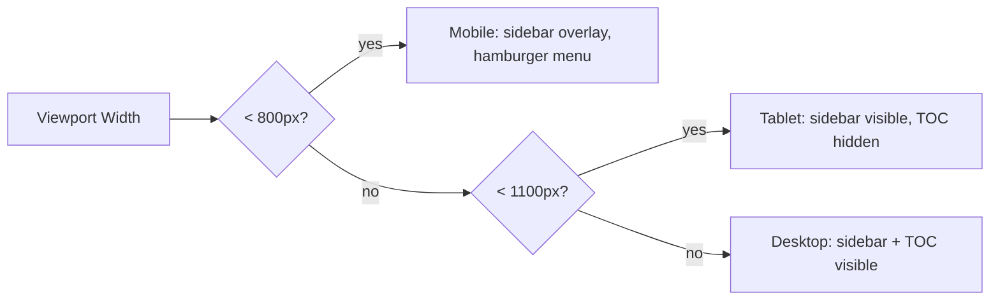

# Configuration

The application uses a dependency injection container (`src/services/container.ts`) with five service interfaces and a central configuration object. All services can be overridden for testing, SSR, or alternative implementations.

## IAppConfig

The `IAppConfig` interface defines runtime application settings:

```ts:desc=IAppConfig interface definition
export interface IAppConfig {
  siteTitle: string;          // Site title displayed in the top bar
  repoEditUrl: string;        // Base URL for "Edit this page" links
  mobileBreakpoint: number;   // Viewport width at which sidebar becomes overlay (default: 800)
  tocBreakpoint: number;      // Viewport width at which TOC hides (default: 1100)
  routes: {
    docs: string;             // URL prefix for doc pages (default: "docs")
  };
}
```

### Default Values

```ts:desc=IAppConfig interface definition
const defaultConfig: IAppConfig = {
  siteTitle: "Docs",
  repoEditUrl: "https://github.com/your-org/your-repo/edit/main",
  mobileBreakpoint: 800,
  tocBreakpoint: 1100,
  routes: { docs: "docs" },
};
```

### Customization

Override config values when creating the container in `src/frontend.tsx`:

```ts:desc=IAppConfig interface definition
import { createContainer } from "./services";

const container = createContainer({
  config: {
    siteTitle: "My Project",
    repoEditUrl: "https://github.com/my-org/my-repo/edit/main/docs",
    mobileBreakpoint: 768,
    routes: { docs: "documentation" },
  },
});
```

With this config, URLs will use `/documentation/slug` instead of `/docs/slug`, the sidebar becomes an overlay below 768px, and the site title changes.

## Service Interfaces

### IStorageService

Wraps `localStorage` for theme and preference persistence:

```ts:desc=IAppConfig interface definition
export interface IStorageService {
  getItem(key: string): string | null;
  setItem(key: string, value: string): void;
  removeItem(key: string): void;
  clear(): void;
}
```

The default implementation (`createStorageService`) uses `localStorage` with silent error handling for private browsing modes.

### IRouterService

Wraps the History API for client-side routing:

```ts:desc=IAppConfig interface definition
export interface IRouterService {
  getCurrentPath(): string;
  pushState(state: unknown, title: string, url: string): void;
  replaceState(state: unknown, title: string, url: string): void;
  onPopState(callback: () => void): () => void;
  buildUrl(prefix: string, slug: string): string;
}
```

The `buildUrl` method constructs URLs using the configured `routes.docs` prefix:

```ts:desc=IAppConfig interface definition
// With routes.docs = "docs":
router.buildUrl("docs", "getting-started/installation")
// Returns: "/docs/getting-started/installation"
```

### IDomService

Wraps DOM manipulation APIs for viewport tracking, scrolling, and event subscriptions:

```ts:desc=IAppConfig interface definition
export interface IDomService {
  getScrollY(): number;
  scrollTo(x: number, y: number): void;
  setAttribute(element: Element, name: string, value: string): void;
  getAttribute(element: Element, name: string): string | null;
  querySelectorAll(selectors: string): NodeList;
  getElementById(id: string): HTMLElement | null;
  setBodyOverflow(value: string): void;
  getViewportWidth(): number;
  onResize(callback: () => void): () => void;       // returns unsubscribe function
  onKeydown(callback: (e: KeyboardEvent) => void): () => void; // returns unsubscribe function
}
```

All event subscription methods return an unsubscribe function for cleanup.

### IThemeService

Manages theme state and Mermaid loading status:

```ts:desc=IAppConfig interface definition
export interface IThemeService {
  getInitialTheme(): boolean;                // true = dark
  applyTheme(isDark: boolean): void;
  toggleTheme(current: boolean): boolean;    // returns new state
  getMermaidLoading(): boolean;
  setMermaidLoading(loading: boolean): void;
  onMermaidLoadingChange(callback: (loading: boolean) => void): () => void;
}
```

`getInitialTheme` checks the `"theme"` localStorage key first, then falls back to `prefers-color-scheme` media query.

## Service Container

The `ServiceContainer` interface aggregates all five services:

```ts:desc=IAppConfig interface definition
export interface ServiceContainer {
  storage: IStorageService;
  router: IRouterService;
  dom: IDomService;
  theme: IThemeService;
  config: IAppConfig;
}
```

### ContainerOptions

The `createContainer()` function accepts a `ContainerOptions` object for overriding any service:

```ts:desc=IAppConfig interface definition
export interface ContainerOptions {
  config?: Partial<IAppConfig>;
  storage?: IStorageService;
  router?: IRouterService;
  dom?: IDomService;
  theme?: IThemeService;
}
```

### Creating the Container

```ts:desc=IAppConfig interface definition
export function createContainer(options: ContainerOptions = {}): ServiceContainer
```

Services are created in dependency order:

1. `storage` -- no dependencies
2. `router` -- no dependencies
3. `dom` -- no dependencies
4. `theme` -- depends on `storage` (for theme persistence)
5. `config` -- built from defaults merged with overrides



## Theme Configuration

### localStorage Keys

| Key | Values | Purpose |
|---|---|---|
| `theme` | `"catppuccin"`, `"tokyonight"`, `"gruvbox"`, `"nord"`, `"everforest"`, `"solarized-light"` | UI theme and syntax highlighting preference |

### Available Themes

```ts:desc=IAppConfig interface definition
const THEMES = [
  { id: "catppuccin", label: "Catppuccin", bg: "#24273a", accent: "#8aadf4" },
  { id: "tokyonight", label: "Tokyo Night", bg: "#1a1b26", accent: "#7aa2f7" },
  { id: "gruvbox", label: "Gruvbox", bg: "#282828", accent: "#d79921" },
  { id: "nord", label: "Nord", bg: "#2e3440", accent: "#88c0d0" },
  { id: "everforest", label: "Everforest", bg: "#2d353b", accent: "#a7c080" },
  { id: "solarized-light", label: "Solarized Light", bg: "#fdf6e3", accent: "#268bd2" },
];
```

The default theme (when no preference is stored) is `catppuccin`.

## Responsive Breakpoints



| Breakpoint | Value | Effect |
|---|---|---|
| `mobileBreakpoint` | 800px | Below this width, the sidebar becomes a slide-in overlay triggered by a hamburger button |
| `tocBreakpoint` | 1100px | Below this width, the Table of Contents panel is hidden |

These are evaluated reactively via `services.dom.onResize` in `App.tsx`:

```ts:desc=IAppConfig interface definition
useEffect(() => {
  const update = () => {
    const w = services.dom.getViewportWidth();
    setIsMobile(w <= services.config.mobileBreakpoint);
    setIsTocMobileBreakpoint(w <= services.config.tocBreakpoint);
  };
  const unsub = services.dom.onResize(update);
  update();
  return unsub;
}, [services]);
```

## Routes Configuration

The `routes.docs` field controls the URL prefix for all documentation pages:

| Config | URL Example |
|---|---|
| `routes.docs: "docs"` (default) | `/docs/getting-started/installation` |
| `routes.docs: "documentation"` | `/documentation/getting-started/installation` |

The root path `/` and the docs prefix path (e.g., `/docs/`) both resolve to the `abstract` slug.

## Dependency Injection in Practice

Services are provided via React context using `ServicesProvider`:

```ts:desc=IAppConfig interface definitionx
// frontend.tsx -- entry point
<ServicesProvider container={defaultContainer}>
  <App />
</ServicesProvider>

// Any component -- access services
const services = useServices();
const path = services.router.getCurrentPath();
```

The `useServices()` hook retrieves the container from context. For testing, provide a custom container with mock service implementations.

## Cross-References

- [Generated Output](./01-generated-output.md) -- how `routes.docs` affects URL resolution
- [File Structure](./05-file-structure.md) -- location of `src/services/container.ts` and `src/frontend.tsx`
- [Migrating from Docusaurus](./06-migrating-from-docusaurus.md) -- configuration differences vs. other SSGs
